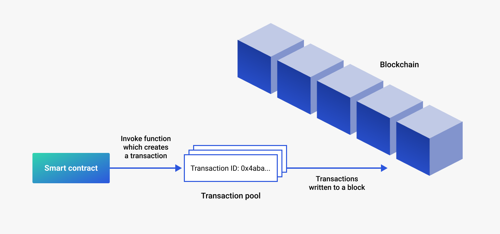

# What does a blockchain comprise

## Nodes

Blockchains are termed **decentralized** which means that they store data across a network of members or nodes who
collaborate to monitor and run the network. Essentially participating members run a blockchain client such as GoQuorum
and connect it to the network as a node.

## Consensus

Transactions in the Transaction Pool must be written to the chain, after being verified and signed. To ensure this
happens and that is agreement on the data and state of the network, we use a consensus mechanism that is a
fault-tolerant. Broadly speaking, there are two types of consensus mechanisms:

* Proof of Work (PoW) like that of Bitcoin, which is both time and compute intensive has blocks created by nodes called
  *miners*
* Proof of Authority (PoA) involves a set of trusted nodes that validate transactions and create blocks. These trusted
nodes are called *validators* and other nodes on the network are called *reader nodes* or *non validating nodes*

GoQuorum supports several PoA algorithms including QBFT, IBFT, Raft and Clique

## Smart contracts

Smart contracts are the gateway to the blockchain world and what serve as the interface to provide controlled access
and a range of functions (such as querying, transacting, updating state etc) to users. Smart contracts are the
key method for encapsulating data and keeping it consistent across the network. They are also used to allow or restrict
members from executing certain functions; and often can restrict access to the network itself. Generally smart contracts
are written in Solidity (which is the most popular), Vyper or Serpent.

## DApps

Decentralized Applications (DApp) are just like any other software application that you use and can be on a website
or an app on your phone. What makes them special is that they're built on a decentralized network (Ethereum) and will
interact with smart contracts that have been deployed to the network. Fundamentally they can be thought of as a GUI
(front end) for a smart contract (back end); and can be written in any language the most popular being Nodejs.

## Permissions

[Permissioning](https://docs.goquorum.consensys.net/en/latest/Concepts/Permissioning/PermissionsOverview/) requires a
distributed network of trust across the network where participants agree to follow the rules. One bad actor can decide
not to follow the rules and other nodes can take action to prevent the bad actor adding to the chain. GoQuorum has
support for node permissioning and account permissioning, allowing only specific nodes and accounts to access the
network.

## Privacy

In a blockchain network, privacy refers to the ability to keep transactions private between the involved participants.
Often in a consortium network, some of the participants prefer to restrict how much information they share or who they
transact with. In other cases, this may not be a concern at all.

GoQuorum supports [privacy](https://docs.goquorum.consensys.net/en/latest/Concepts/Privacy/Privacy/) and this is
handled using a private transaction manager paired to your member node, typically
[Tessera](https://docs.tessera.consensys.net/en/stable/). Tessera uses an enclave for cryptographic functionality and
stores and allows access to encrypted transaction data, and exchanges encrypted payloads with other Tessera nodes.
Tessera is restful/stateless and can be load balanced easily.

## Forks

Forks are essentially a split in the network or they can also add functionality (EIPs or Ethereum Improvement Program)
to the protocol from a given community agreed on block.

Hardforks are radical changes to the network, that may make a block (or a certain chain of blocks) invalid or vice-versa.
Hard forks also require all nodes to upgrade to the latest version of the client. It is important to note that these are
permanent deviations from the main chain.
