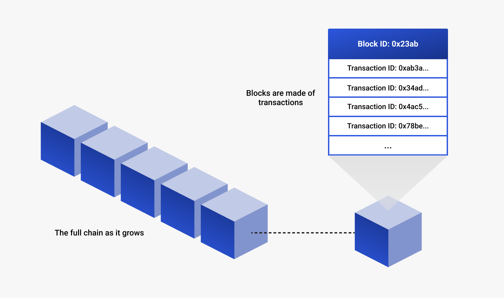

# Blockchain introduction

## What is a blockchain?

A blockchain is a shared, immutable electronic ledger (or digital database) that keeps a record of transactional data.
Blockchains are decentralized, which means that they store data across a network of members who collaborate to monitor
and run the network.
The system as such cannot be owned a single entity, but rather by everyone on the network.

The *block* in *blockchain* refers to a block of transactions that has been broadcast to the network.
The *chain* refers to a string of these blocks in chronological order.
When a new block of transactions is securely validated by the network, it is attached to the end of an existing chain.
This chain of blocks is an ever-growing ledger of transactions, each of which can be traced, providing
accountability and transparency unavailable on traditional ledgers.

## What problems do blockchains solve?

We live in a highly transactional world, where we must constantly trust one another with sensitive data, transactions, and records.
Most of our interactions on the Internet run on centralized web servers (for example, banks) and massive amounts of user
data often exist in a single database.
This poses a few risks, as current databases are designed to be controlled by trusted administrators who can read, alter,
block, or delete data.
In addition, the centralized architecture of the Internet today is vulnerable to censorship and targeted attacks by both
hackers and internal bad actors.

The value of a blockchain is the certainty of the network: participants can establish a trusted and immutable record of
transactions without the need for intermediaries.
The decentralized architecture of a blockchain---a global network of computers simultaneously running the software and
validating the chain of transactions---is what ensures that the transaction record is never compromised.
It makes a blockchain network less likely to fail and harder to attack.

## Why do I need a blockchain for my business?

Blockchains introduce a new model of doing business, where networks have standard methods for transactions, data storage,
and establishing identities of all participants.
Blockchains foster trust between participants, with decentralization and improved security.
Participants' privacy concerns are addressed by anonymizing data and requiring permissions to limit access.
Transaction visibility enables businesses to track the origins of an asset accurately, and maintain inventory and quality
of goods.

The biggest benefit of blockchains is the opportunities that arise for businesses to grow and collaborate.
Multiple organizations can come together to create a *consortium network* working towards a shared goal, where terms
and permissions are agreed upon and deployed to the blockchain.
These policies can evolve over time, updating through participant-based governance.

Blockchains can help make your business smoother and more efficient, allowing you to focus on growing your business.

