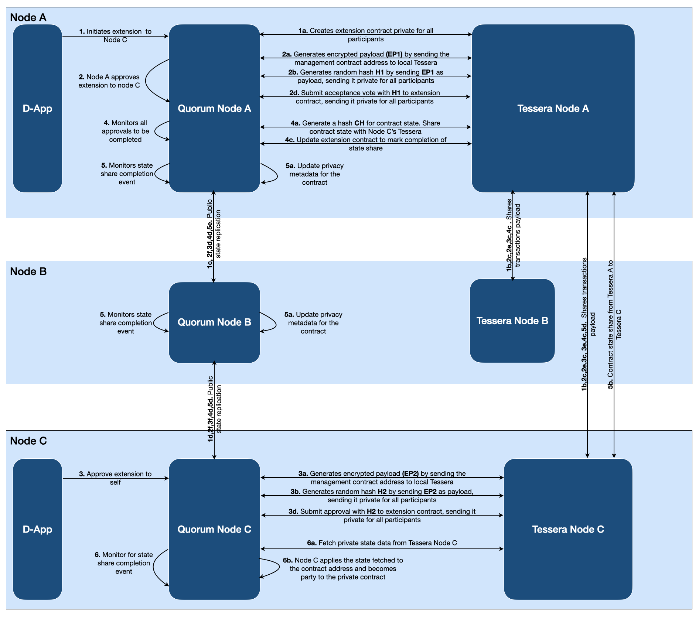

# Contract state extension

Once a private contract is deployed, it is only available on the nodes where it was initially deployed.
This means any new node will not have access to the private contract as it does not have the code nor any
of the state associated with it. In real life scenarios, we do see a need where a private contract deployed
to set of initial participant nodes, need to be extended to a new node which has become part of the business
flow. Contract state extension feature addresses this requirement.

It should be noted that as a part of contract state extension only the state of the contract as of the
time of extension is shared. This means that there is no history of the contract, and attempting
to view it will not yield any result, as the new recipient was not party at that time. This
also means that events are not shared either, as the transactions are not shared and no state transitions are calculated.

!!! note

    Mandatory recipients are defined at contract creation time and cannnot be amended/extended, however such contracts could still be extended to other nodes in the network.

## Flow

The following diagram describes the flow of contract state extension.

For the purpose of the flow description, "**all participants**" in the below description refers to:

- For *"**Standard Private**"* type of contracts, it will be node initiating the extension and the node to which the contract is being extended
- For *"**Party Protection**"*, *"**Mandatory Party Protection**"* & *"**State Validation**"* type of contracts, it will include all the nodes which are current participant of the contract and the new node to which it is being extended

In this example, an existing private contract deployed between Nodes A and B is being extended to  Nodes C from Node A.

1. User in node A proposes the extension of the contract, citing C's Private Transaction Manager(PTM)
    public keys as private participants of this extension, node C's public Ethereum key as a receiving
    address of this extension, and node C's PTM public key as the target receiver.
    - **1a** - Node A identifies all participants for the contract being extended and creates the extension contract with user given inputs and PTM public keys of all participants
    - **1b** - the private transaction payload is shared with Tessera of participants.
    - **1c** - The public state is propagated across all nodes. All participant nodes see an emitted log,
        and start watching the contract address that emitted the event for subsequent events that may happen. This contract address is the management contract for the extension process. A new management contract is created with each extension.

1. Node A automatically approves the contract extension by virtue of creating the extension contract.
    In the approval process:
    - **2a** - Node A calls its local Tessera node to encrypt the management contract address
    - **2b** - Node A sends a private transaction to all participants with the encrypted payload from the previous step to generate a random hash for the approval process.
    - **2c** - The private transaction is propagated to the Tessera of all participants
    - **2d** - Node A approves the extension with the hash generated (in step 2b)
    - **2e & 2f** - Private transaction payload is shared with Tessera of all participants. Public state is propagated across all nodes

1. Since the state sharing does not execute the transactions that generate the state
    (in order to keep history private), there is no proof that can be provided by the proposer
    that the state is correct. In order to remedy this, the receiver must accept the proposal for the
    contract as the proof. In this step, the user owning the Ethereum public key of node C which was
    marked as receiving address, approves the contract extension using GoQuorum APIs
    - **3a** - Node C calls its local Tessera node to encrypt the management contract address
    - **3b** - Node C sends a private transaction to all participants with the encrypted payload from the previous step to generate a random hash for the approval process.
    - **3c** - The private transaction is propagated to the Tessera of all participants
    - **3d** - Node C approves the extension with the hash generated (in step 3b)
    - **3e & 3f** - Private transaction payload is shared with Tessera of all participants. Public state is propagated across all nodes

1. Node A monitors for acceptance of contract extension by Node C. Once accepted
    - **4a & 4b** - Node A fetches the state of the contract and sends it as a "private transaction"
        to Node C. It then submits the PTM hash of that state to the contract, including the recipient's
        PTM public key.
    - **4c** - Node A submits a transactions to mark completion of state share. This transaction emits
        a log which will get picked up by the receiver when processing the transaction
    - **4d & 4e** - Private transaction payload is shared with Tessera nodes C. Public state is
        propagated across all nodes

1. Node A & B monitors for state share event
    - **5a** - Upon noticing the state share event as a part of block processing, node A & B update the privacy metadata for the contract being extended. *This step will be executed only for party protection, mandatory party protection or private state validation type of contracts.*

1. Node C monitors for state share event
    - **6a** - Upon noticing the state share event as a part of block processing, node C fetches the
        contract private state data from its local Tessera node
    - **6b** - Node C applies the fetched state to the contract address and becomes party of the private contract

> Steps (2a, 2b, 2c) and (3a, 3b. 3c) are required to handle data recovery of transaction manager data. In original extension design, the node accepting the extension does so by voting with a hash which is generated by sending a private transaction with management contract address as the payload to self. This hash is further verified at the time of extension to validate the rightful node for extension. In the event if the  node loses its transaction manager and has to recover transactions using resend from other nodes in the network, this self voting transaction is never recoverable. Subsequently if that node ever recovers the chain then it will never be able to process the past contract extension transactions and set state for the private contract.

## With enhanced network permissioning

If the network is running with [enhanced network permissioning](../PermissionsOverview.md#enhanced-network-permissioning):

- Initiation of contract extension can only be done by a network administrator or organization administrator.
- Contract extension can be accepted only by a network administrator or organization administrator.
