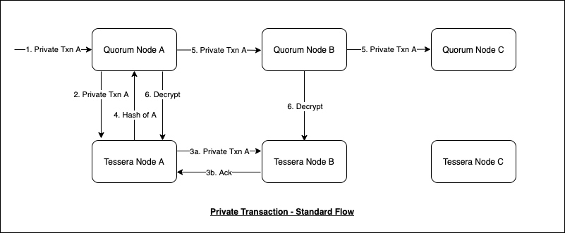
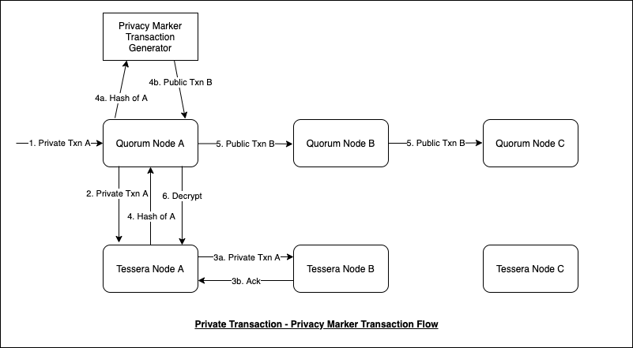
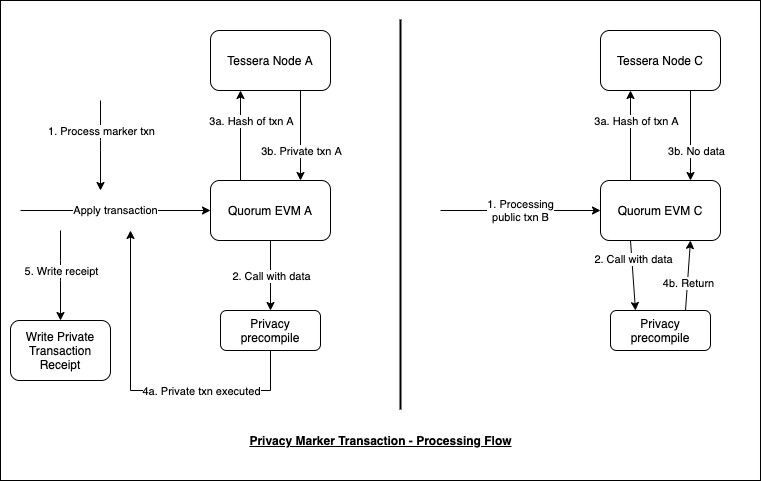
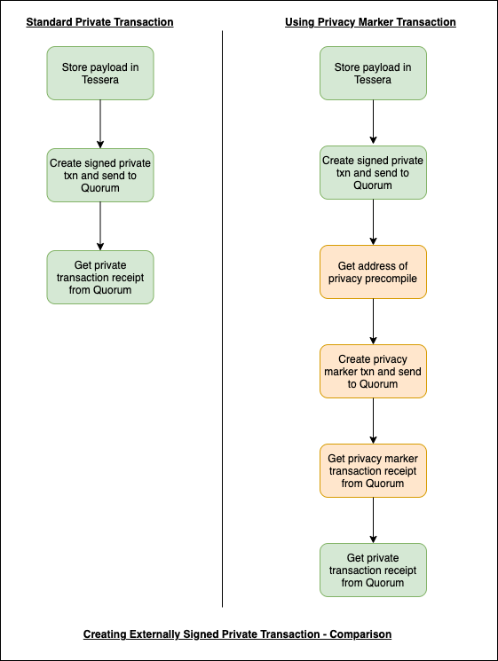

# Privacy Marker Transactions

GoQuorum v21.??.? introduces a new method for processing private transactions, which can be used instead of the 'legacy' private transaction flow.
This makes use of a new type of public transaction referred to as a "Privacy Marker Transaction".
The privacy marker transaction is distributed across the network, instead of the private transaction.
The private transaction itself is only available to the participants.

This functionality is enabled using a new command line flag and genesis flag (see [Configuration Changes]).

The advantages of using a Privacy Marker Transaction over a standard Private Transaction are as follows:

* The contract address is hidden from public view.
* The private transaction receipt is only visible to participants of the private transaction.
* The private transaction itself is stored in the private transaction manager and is only visible to participants.

The Privacy Marker Transaction makes use of a new precompiled contract held in GoQuorum.

!!! info "Precompile Address"
    A new API method [eth_getPrivacyPrecompileAddress] has been added to retrieve the address of the precompile.

## Transaction submission when using standard private transactions



1. Private transaction sent to GoQuorum, to be signed on the node.
2. Transaction serialised to JSON and sent to Tessera with details of participants parties.
3. Transaction data is distributed to participants.
4. 'Data' field in transaction is replaced with hash returned from tessera, and transaction is signed on the node. V value is changed to mark it as a private transaction.
5. Private transaction is distributed throughout the network.
6. Only participants are able to obtain a decrypted payload from Tessera and execute the transaction.

## Transaction submission when using privacy marker transaction



1. Private transaction sent to GoQuorum, to be signed on the node.
2. Transaction serialised to JSON and sent to Tessera with details of participants parties.
3. Transaction data is distributed to participants.
4. Privacy marker transaction is created, with 'Data' field set to hash of private transaction returned from tessera. Transaction is signed on the node.
5. Privacy marker transaction is distributed throughout the network.
6. Only participants are able to obtain the decrypted private transaction from Tessera and execute it.

## Transaction processing when using privacy marker transaction



The privacy marker transaction is processed in the same way as a standard public transaction.
Since the `To` value in the transaction is the address of the precompiled contract, that contract will be called.

1. Public marker transaction is processed.
2. Precompile is called with the transaction data, which is the hash of the private transaction.
3. The private transaction is retrieved from Tessera.
4. Action depends on whether the node is a participant:
    1. Participant node: recursive call to ApplyTransaction, this time using the private transaction.
    2. Non participant: no private transaction found, so return immediately.
5. Write the private transaction receipt directly to the database.

## Externally signed private transactions

This diagram shows the key differences when creating an externally signed private transaction using privacy marker transactions.
Non-green boxes show the new steps required.



Note that when using privacy marker transactions,
the final step of retrieving the private transaction receipt uses the new API method [eth_getPrivateTransactionReceipt].

## New API Methods

### eth_getPrivateTransaction

Input: Private marker transaction hash

Output: Private transaction

!!! note
    Goes to Tessera to retrieve the private data associated with the privacy marker transaction,
    so needs Tessera online at time of transaction retrieval.

### eth_getPrivateTransactionReceipt

Input: Private marker transaction hash

Output: Private transaction receipt

### eth_distributePrivateTransaction

Input: Serialised private transaction, Private for parameters

Output: Tessera hash to put in marker tx

!!! note
    Two step process:

    1. Performs the same as eth_sendRawPrivateTransaction (simulation and calling `/sendsignedtx`), but doesn’t submit private transaction to txpool.
    2. Sends the private transaction to Tessera to generate a hash, which will be put in the privacy marker transaction.

### eth_getPrivacyPrecompileAddress

Output: Contract address for the privacy precompile

## GoQuorum Configuration Changes

### Command Line Flag

The command line flag `--privacymarker.enable` is needed in order to enable the creation of privacy marker transactions.
If this flag is specified, then whenever a private transaction is submitted to GoQuorum, it will lead to the creation of a privacy marker transaction.

### Genesis Flag

The `genesis.json` file has been modified to include the `quorumPrecompilesV1Block` flag.
This flag enables the precompiled contract which is required for processing of privacy marker transactions.
The value for this flag should be set to an appropriate value in the future, by when the entire network would be upgraded with the correct GoQuorum version that supports the precompile.
The flag should be initialised with same value across all the nodes.

!!! example

    To enable the flag from block 10000:

    ```json
    "config": {
        "quorumPrecompilesV1Block": 10000
    }
    ```

<!--links-->
[Configuration Changes]: #goquorum-configuration-changes
[eth_getPrivacyPrecompileAddress]: #eth_getprivacyprecompileaddress
[eth_getPrivateTransactionReceipt]: #eth_getprivatetransactionreceipt
