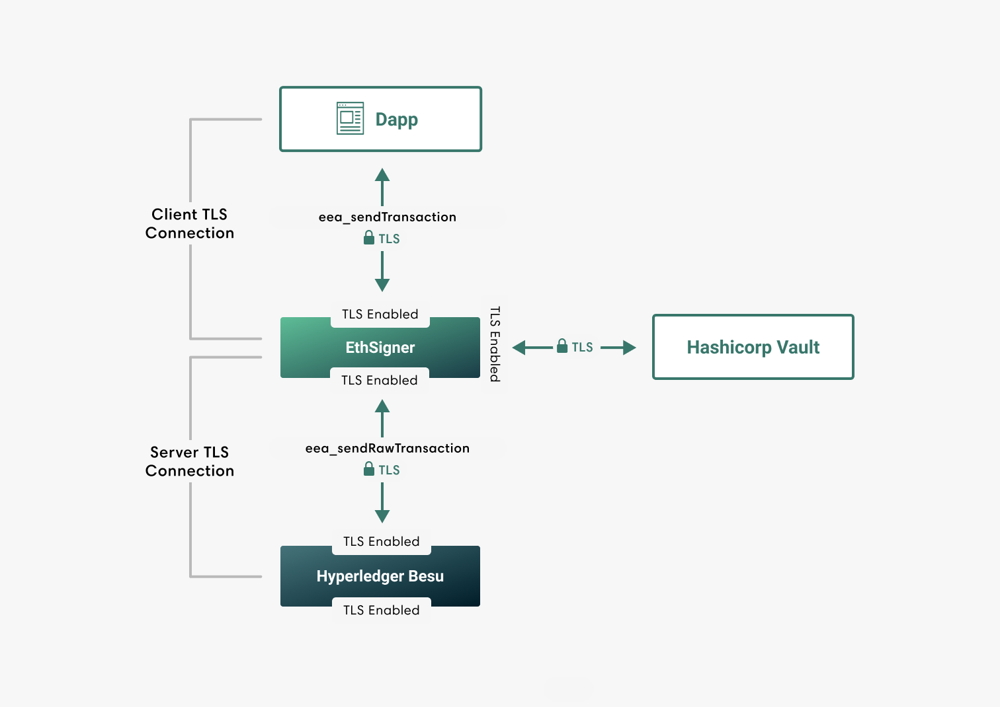

# TLS communication

EthSigner supports TLS to secure inbound and outbound HTTP JSON-RPC
requests, and communication with Hashicorp Vault.

Private keys and certificates for client and server TLS connections must be
stored in password-protected PKCS #12 keystores. The [server
(in this example, Hyperledger Besu) must be configured](https://besu.hyperledger.org/en/latest/Concepts/TLS/) to
accept TLS connections.

Use the command line options to configure TLS on
[HTTP JSON-RPC requests](../HowTo/Configure-TLS.md) and [Hashicorp Vault](../HowTo/Store-Keys/Use-Hashicorp.md).