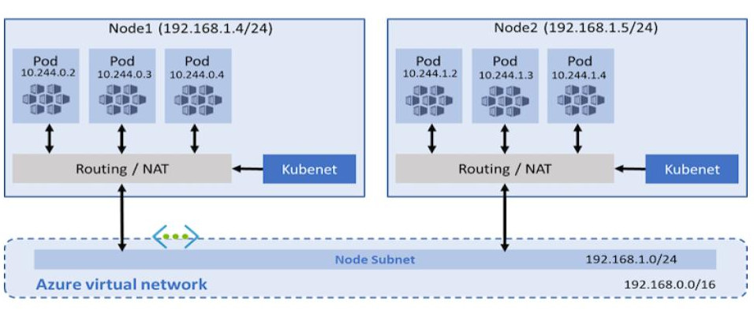
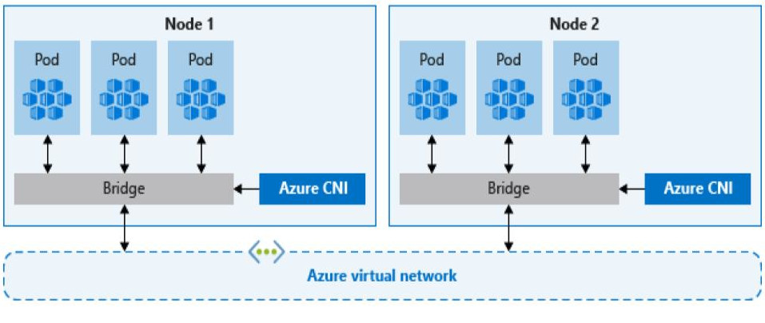
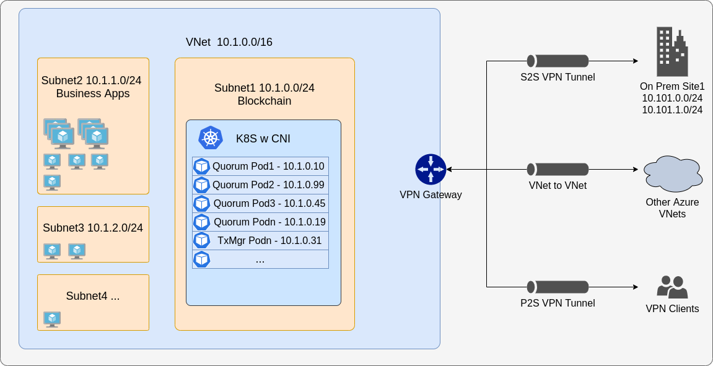

## Kubernetes

[Quorum-Kubernetes](https://github.com/ConsenSys/quorum-Kubernetes) is the central repository that contains Kuberentes
manifests and Helm charts that can be customised and deployed on a local cluster or in cloud

We recommend starting with the [playground](https://github.com/ConsenSys/quorum-kubernetes/tree/master/playground) folder
and working through the example setups there and then moving to the next [dev](https://github.com/ConsenSys/quorum-kubernetes/tree/master/dev)
stage and finally to the [prod](https://github.com/ConsenSys/quorum-kubernetes/tree/master/prod) section. The dev and
prod folders are identical in terms of what gets deployed, but differ in that the prod folder natively uses best
practices to manage identity (Managed Identities in Azure and IAM in AWS) and vaults (KeyVault in Azure and KMS in AWS)
along with CSI drivers.

Every setup in there has monitoring and we strongly recommend deploying the monitoring manifests or charts where you
get an overview of the network, nodes, volumes etc and you can create alerts accordingly. In addition there is example
config for ingress and routes which you can customize to suit your requirements

### Cloud support

At present, the repository supports AWS EKS and Azure AKS natively and you can configure the provider in the
[values.yml](https://github.com/ConsenSys/quorum-kubernetes/blob/master/dev/helm/values/genesis-goquorum.yml) and set
the `provider` to local, aws or azure. You may also need to pass in extra config such as a keyvault name or the like.

The repo also has [Azure ARM templates](https://github.com/ConsenSys/quorum-kubernetes/tree/master/azure) and [AWS
eksctl](https://github.com/ConsenSys/quorum-kubernetes/tree/master/aws) templates that you can use to deploy the base
infrastructure required.

## Limitations

Kubernetes has a limitation when using multi clusters in that it's load balancers disallow TCP and UDP traffic on the same
port. This inhibits discovery working natively for each pod and here are some solutions to mitigate this:

* Disallow discovery and use static nodes - this limits P2P traffic as just TCP and this is not an issue for load balancers
 and exposing nodes publicly
* If you need to use discovery, you need to use something like
 [CNI](https://github.com/containernetworking/cni/blob/master/SPEC.md#network-configuration) that is supported by all
 major cloud providers and the cloud templates have CNI ready to go

### CNI

With the traditional Kubelet networking mode, nodes get an IP from the virtual network subnet. Each node in turn uses NAT
to configure the pods so that they reach other pods on the virtual network. This limits where they can reach but also more
specifically what can reach them, for example an external VM which has to have custom routes and this does not scale well.

CNI on the other hand allows every pod to get a unique IP directly from the virtual subnet which removes the above restriction.
It therefore has a limit on the maximum number of pods that can be spun up so you need to plan ahead to avoid IP exhaustion

## Multi cluster

To use multi cluster or to connect external nodes to an existing Kubernetes cluster you need to enable [CNI](#cni). To
connect multiple clusters together the must each have different CIDR blocks so there are no conflicts and the first step
is to peer the VPCs or VNets together and update the route tables. From that point on you can use static nodes and pods
will communicate cross cluster

The same setup also works to connect external nodes, business apps etc from other infrastructure either in cloud or on
premise.

