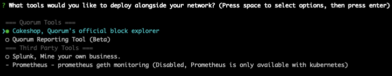

# GoQuorum Wizard Tools

When using the Simple and Custom Network options in the wizard, you are give the option to deploy some tools alongside your network:

## Cakeshop

[Cakeshop](https://github.com/ConsenSys/cakeshop) is Quorum's official block explorer and node monitoring tool. You can use it to inspect blocks, deploy contracts, manage peers, and more.

Once you have selected this tool and started the network, it can be accessed at [http://localhost:8999](http://localhost:8999)

## Reporting Tool

The [Reporting Tool](https://github.com/ConsenSys/quorum-reporting) provides convenient APIs for generating reports about contracts deployed to your network. Once a contract is registered, it is easy to inspect the transactions related to that contract and see how the state of the contract has changed over time.

Once you have selected this tool and started the network, the Reporting UI can be accessed at [http://localhost:3000](http://localhost:3000). The RPC API itself runs at [http://localhost:4000](http://localhost:4000).

## Splunk

[Splunk](https://splunkbase.splunk.com/app/4866/#/details) is a third-party monitoring solution that works with GoQuorum. If you add Splunk to your network (docker-compose only), all logs will be directed to the local Splunk container. From there, you can search through the logs, see network metrics, and create custom dashboards with the data that you are interested in.

Once you have selected this tool and started the network, the Splunk UI will be accessible at [http://localhost:8000](http://localhost:8000)

## Prometheus

[Prometheus](https://prometheus.io) is a third-party metrics and monitoring solution that works with GoQuorum. If you add Prometheus to your network (kubernetes only), you will be able to generate graphs based on network data. You can also point your own instance of Grafana to Prometheus to get a quick dashboard with blocks/transactions per second, cpu and memory usage, network information, and more.

Once you have selected this tool and started the network, run the getEndpoints.sh script to get the endpoint for the Prometheus UI.
