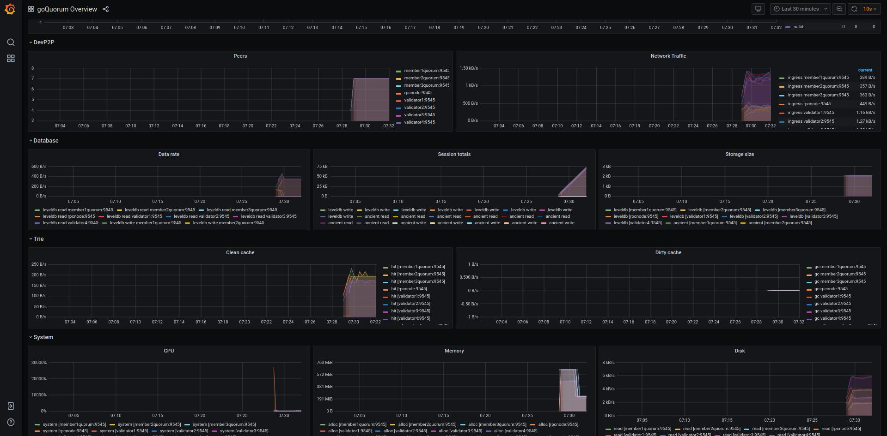

# Monitoring Quorum Node

GoQuorum version 2.6.0 upgraded to Geth version 1.9.7.
Upgrade adds the ability to collect enhanced metrics which can then be used in different visualization tools for node monitoring.
Refer to [Geth v1.9.0](https://blog.ethereum.org/2019/07/10/geth-v1-9-0/) for complete list of added features.

This page explains how to configure a GoQuorum node to provide enhanced metrics and enable monitoring.

## Metrics Collection

Node monitoring requires to collect metrics data and expose them to the monitoring tools.
GoQuorum node can collect and expose the data to [ExpVars](https://golang.org/pkg/expvar/), [InfluxDB](https://www.influxdata.com/products/influxdb-overview/) or [Prometheus](https://prometheus.io/)

* Bringing up GoQuorum node with `--metrics --pprof` will expose the metrics data in `expvar` format at `http://127.0.0.1:6060/debug/metrics`

* Bringing up GoQuorum node with `--metrics --pprof` will also expose the metrics data in Prometheus format at `http://127.0.0.1:6060/debug/metrics/prometheus`

* The metrics data can be pushed to [InfluxDB](https://www.influxdata.com/products/influxdb-overview/) by bringing the node up with `--metric.influxdb` and related flags.

The complete list of flags are as given below:

```bash
LOGGING AND DEBUGGING OPTIONS:
  --pprof                             Enable the pprof HTTP server
  --pprofaddr value                   pprof HTTP server listening interface (default: "127.0.0.1")
  --pprofport value                   pprof HTTP server listening port (default: 6060)
  
METRICS AND STATS OPTIONS:
  --metrics                           Enable metrics collection and reporting
  --metrics.expensive                 Enable expensive metrics collection and reporting
  --metrics.influxdb                  Enable metrics export/push to an external InfluxDB database
  --metrics.influxdb.endpoint value   InfluxDB API endpoint to report metrics to (default: "http://localhost:8086")
  --metrics.influxdb.database value   InfluxDB database name to push reported metrics to (default: "geth")
  --metrics.influxdb.username value   Username to authorize access to the database (default: "test")
  --metrics.influxdb.password value   Password to authorize access to the database (default: "test")
  --metrics.influxdb.tags value       Comma-separated InfluxDB tags (key/values) attached to all measurements (default: "host=localhost")
```

**!!NOTE** `pprof` http end point should not be exposed to public internet as this can be used to trigger resource intensive operations

## Metrics Visualization

The metrics data collected can be easily exposed to different visualization tools. Shown below are the GoQuorum monitoring dashboard with [Grafana](https://grafana.com/).




*The above dashboards were built with minor changes to [this](https://github.com/karalabe/geth-prometheus)*
