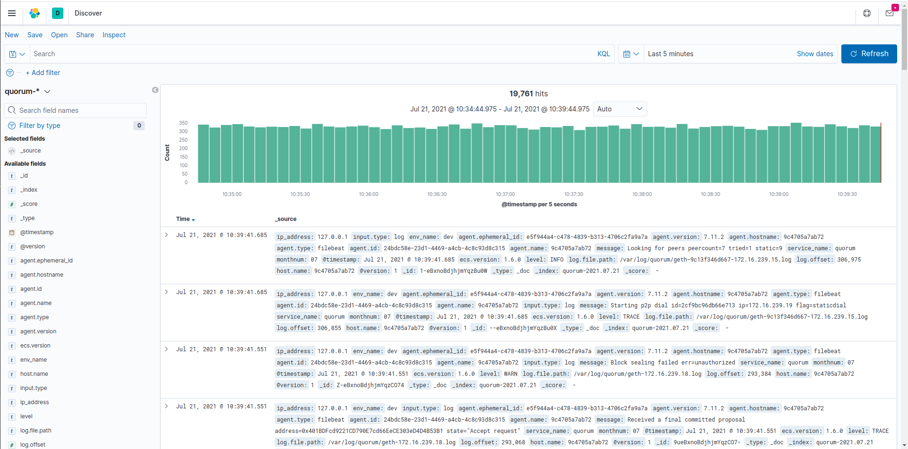

# Elastic Stack

Elastic Stack (ELK) is a common open-source log management platform.

The [Quorum Developer Quickstart](https://github.com/ConsenSys/quorum-dev-quickstart) provides example implementations
using ELK for log management.

The [Filebeat] configuration ingests logs, and the [Metricbeat] configuration collects metrics from the nodes at regular
defined intervals and outputs them to Redis for storage.
Redis provides a highly available mechanism enabling storage by any of the Elastic Beats and pulled by Logstash as required.

The [pipeline configuration] defines the JSON format used for GoQuorum logs and automatically picks up any new log fields.

!!! note

    The pipeline configuration must match the your log format.
    If using the default, you can use the [grok plugin](https://www.elastic.co/guide/en/logstash/current/plugins-filters-grok.html)
    to extract the log fields.

To see the GoQuorum Quickstart network logs in Kibana:

1. [Start the Quorum Developer Quickstart with Besu](../../Tutorials/Quorum-Dev-Quickstart.md), selecting the appropriate options.
1. Open the [`Kibana logs address`](http://localhost:5601/app/kibana#/discover) listed by the sample networks `list.sh` script.
   The logs display in Kibana.

    

<!-- Links -->
[Filebeat]: https://github.com/ConsenSys/quorum-dev-quickstart/blob/master/files/common/filebeat/filebeat.yml
[Metricbeat]: https://github.com/ConsenSys/quorum-dev-quickstart/blob/master/files/common/metricbeat/metricbeat.yml
[pipeline configuration]: https://github.com/ConsenSys/quorum-dev-quickstart/blob/master/files/common/logstash/pipeline/20_quorum.conf
