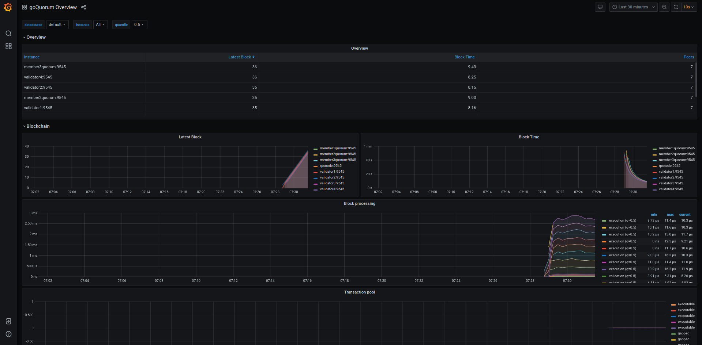

# Monitor node performance

You can configure a GoQuorum node to collect metrics that can be viewed in a visualization tool
like [Grafana].

This page explains how to configure a GoQuorum node to provide metrics and enable monitoring.

## Collect metrics

A GoQuorum node can collect and expose the metrics data in the following formats:

- [ExpVars]; the standard Go interface to instrument and expose metrics via HTTP.
- [Prometheus]; an alternative to ExpVars, and the preferred option because it allows users to
    pull or push metrics, and has a consistent metric format across languages.
- [InfluxDB]; metrics can only be pushed to Influx.

Use GoQuorum `--metrics`, `--pprof`, `--pprofaddr` and `pprofport`
(where applicable, the default port is 6060) [command line options], and set the scraper endpoints
to the following:

- In ExpVar format at `http://127.0.0.1:6060/debug/metrics`
- In Prometheus format at `http://127.0.0.1:6060/debug/metrics/prometheus`

!!! critical "Security warning"

    Do not expose the `pprof` HTTP end point to the public internet.

    This end point can be used to trigger resource intensive operations.

Use `--metric.influxdb` and associated [command line options] to push metrics data to [InfluxDB].

!!! note "Exerpt of geth command line options"

    ```text
    LOGGING AND DEBUGGING OPTIONS:
      --pprof                             Enable the pprof HTTP server
      --pprofaddr value                   pprof HTTP server listening interface (default: "127.0.0.1")
      --pprofport value                   pprof HTTP server listening port (default: 6060)

    METRICS AND STATS OPTIONS:
      --metrics                           Enable metrics collection and reporting
      --metrics.expensive                 Enable expensive metrics collection and reporting
      --metrics.influxdb                  Enable metrics export/push to an external InfluxDB database
      --metrics.influxdb.endpoint value   InfluxDB API endpoint to report metrics to (default: "http://localhost:8086")
      --metrics.influxdb.database value   InfluxDB database name to push reported metrics to (default: "geth")
      --metrics.influxdb.username value   Username to authorize access to the database (default: "test")
      --metrics.influxdb.password value   Password to authorize access to the database (default: "test")
      --metrics.influxdb.tags value       Comma-separated InfluxDB tags (key/values) attached to all measurements (default: "host=localhost")
    ```

## Visualize collected data

GoQuorum metrics data can be visualised with many dashboard tools. We provide a
[goQuourm dashboard](https://grafana.com/grafana/dashboards/14360) that can be imported into your
instance of Grafana.

!!! tip

    If using the [Quorum Developer Quickstart](https://docs.goquorum.consensys.net/en/stable/Tutorials/Quorum-Dev-Quickstart/)
    the dashboard is pre-installed in the Grafana container, and the example shows how to configure
    nodes to use Prometheus to send metrics to Grafana.




[Grafana]: https://grafana.com/
[ExpVars]: https://golang.org/pkg/expvar/
[Prometheus]: https://prometheus.io/
[InfluxDB]: https://www.influxdata.com/products/influxdb-overview/
[command line options]: https://geth.ethereum.org/docs/interface/command-line-options
