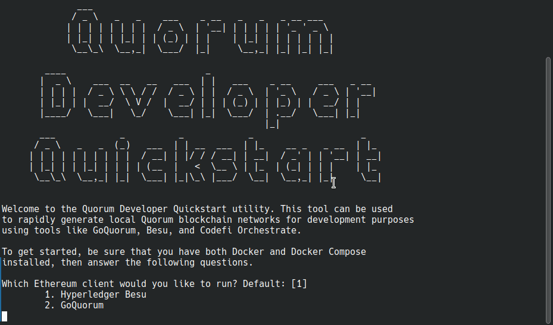

# Get started with Quorum Developer Quickstart

The [Quorum Developer Quickstart](https://github.com/ConsenSys/quorum-dev-quickstart) is a command line tool that allows
users to set up a development GoQuorum network on their local machine in less than two minutes.
The quickstart is written in Javascript and designed to be run as a global npm module from the command line.



## Prerequisites

* [Node.js and NPM](https://docs.npmjs.com/downloading-and-installing-node-js-and-npm) version 14 or higher
* [Docker and Docker-compose](https://docs.docker.com/compose/install/)
* [Truffle](https://www.trufflesuite.com/truffle) development framework
* [`curl` command line](https://curl.haxx.se/download.html)
* [MetaMask](https://metamask.io/)

## Run Quorum Developer Quickstart

To run the quickstart without installation, use `npx`:

```sh
npx quorum-dev-quickstart
```

You can also install the quickstart globally with `npm`:

```Bash
npm install -g quorum-dev-quickstart

# Once the global module is installed, run:
quorum-dev-quickstart
```

!!! Note

    Many npm installations don't have permission to install global modules and will throw an EACCES error.
    npm has [a recommended solution](https://docs.npmjs.com/resolving-eacces-permissions-errors-when-installing-packages-globally).

## Options

You can provide these flags when running `quorum-dev-quickstart`:

| Flag                         | Required to skip prompt | Description                                                                             |
| :----------------------------| :---------------------- | ----------------------------------------------------------------------------------------|
| `--clientType=<STRING>`      | Yes                     | Use `quorum` for GoQuorum.                                                              |
| `--privacy=<true|false>`     | Yes                     | Enables or disables private transaction support.                                        |
| `--orchestrate=<true|false>` | No                      | Enables support for [ConsenSys Orchestrate](https://consensys.net/codefi/orchestrate/). |
| `--monitoring=<STRING>`      | No                      | Use `default` for Prometheus, Grafana, and Cakeshop; `elk` to add ELK; `splunk` to add Splunk. |
| `--outputPath=<PATH>`        | No                      | Path to output artifacts.                                                               |
| `-h`, `--help`               | No                      | Show help.                                                                              |

## Interacting with the network

To explore the features of GoQuorum, such as permissioning and privacy, follow the
[Quorum Developer Quickstart tutorial](Using-the-Quickstart.md).
The tutorial also has information on smart contracts, dapps, wallets, and monitoring the network.

## Tools

The quickstart provides the option to deploy monitoring tools alongside your network.
You can use:

* [Prometheus and Grafana](../../HowTo/Monitor/Metrics.md) to collect and visualize metrics.
* [Cakeshop](../../HowTo/Monitor/Cakeshop.md) to explore the chain, work with contracts, and manage peers and permissions.
* [Quorum Reporting](../../HowTo/Monitor/Quorum-Reporting.md) to inspect contracts.
* [Elastic Stack](../../HowTo/Monitor/Elastic-Stack.md) to manage logs.
* [Splunk](../../HowTo/Monitor/Splunk.md) to manage logs.

## Developing

1. Clone the repo to your local machine:

    ```bash
    git clone https://github.com/ConsenSys/quorum-dev-quickstart.git
    ```

1. Change into the quickstart directory:

    ```bash
    cd quorum-dev-quickstart
    ```

1. Install all dependencies:

    ```bash
    npm install
    ```

1. Build changes to any files in the `src` directory and output to a build directory:

    ```bash
    npm run build
    ```

1. Run the updated quickstart:

    ```bash
    npm run start
    ```

    Alternatively, you can run `node build/index.js`.

## Contributing

Quorum Dev Quickstart is open source, and we invite you to contribute enhancements.
You will be required to complete a Contributor License Agreement (CLA) before we are able to merge.
If you have any questions about the contribution process, you can get them answered on the [GoQuorum Discord](https://discord.gg/5U9Jwp7).

## Getting help

Stuck on a step? Please join the [GoQuorum Discord](https://discord.gg/5U9Jwp7) for support.
