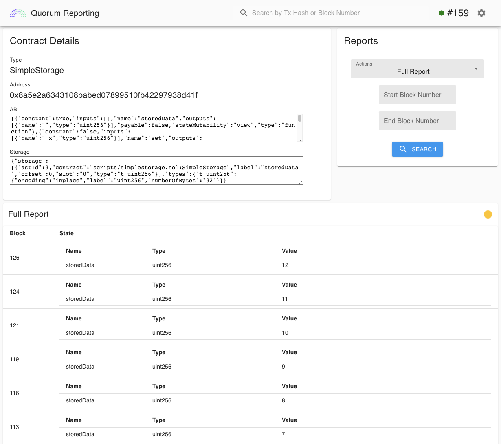
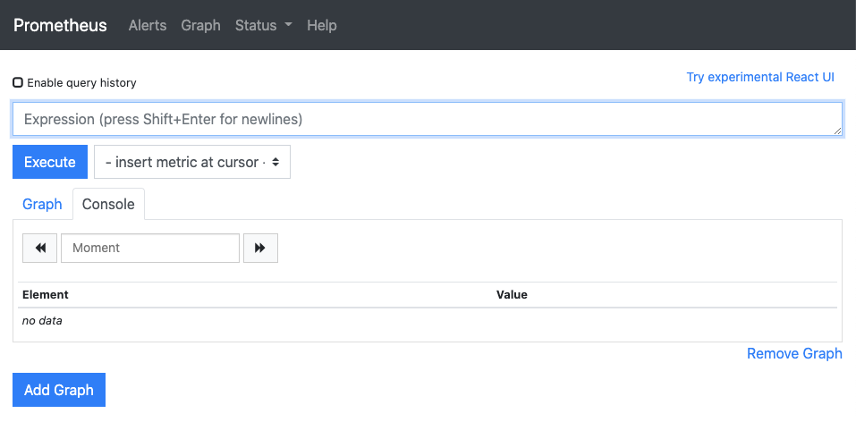
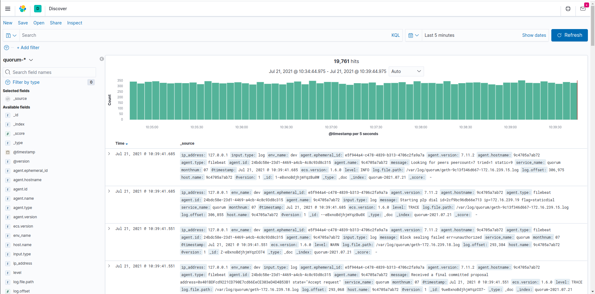
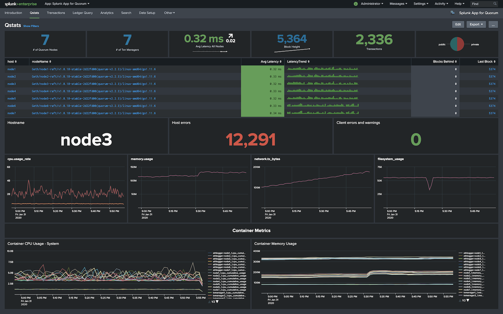

# Quorum Dev Quickstart Tools

When using the quickstart you are presented with a few options for monitoring:

* **Default** uses [Cakeshop](#cakeshop), [Prometheus](#prometheus-and-grafana), [Grafana](#prometheus-and-grafana), and
  [Alethio Block Explorer](https://github.com/Alethio/ethereum-lite-explorer).
* **ELK** uses the default options and adds support for the [Elastic Stack](#elastic-stack) (logs).
* **Splunk** uses the default options and adds support for [Splunk](#splunk) (logs and metrics).

## Cakeshop

[Cakeshop](https://github.com/ConsenSys/cakeshop) is GoQuorum's block explorer and node monitoring tool.
Out of the box you get:

* **Blockchain Explorer** - View transactions, blocks and contracts, and see historical contract state at a point in time.
* **Contract Registry** - Keep track of deployed contracts, along with their code, interfaces, and state.
* **Node Info** - View the overall status of your network.
* **Peer Management** - Easily discover, add, and remove peers.
* **Enhanced Permissions UI** - Manage smart-contract-based [enhanced permissioning](../../Concepts/Permissioning/Enhanced/EnhancedPermissionsOverview.md).
* **Solidity Sandbox** - Develop, compile, deploy, and interact with Solidity smart contracts.

Cakeshop provides tools for connecting to multiple nodes, managing peers and permissions, exploring the state of the chain,
and working with contracts.

The Cakeshop package includes a [Solidity](https://solidity.readthedocs.org/en/latest/) compiler and all dependencies.

[Get started with Cakeshop.](../../Reference/Cakeshop/GettingStarted.md)

Once you have selected this tool and started the network, you can access it at [http://localhost:8999](http://localhost:8999).

## Reporting Tool

The [Reporting Tool](https://github.com/ConsenSys/quorum-reporting) provides convenient APIs for generating reports
about contracts deployed to your network.
Once a contract is registered, it is easy to inspect the transactions related to that contract and see how the state of
the contract has changed over time.

Once you have selected this tool and started the network, you can access the Reporting UI at
[http://localhost:3000](http://localhost:3000).
The RPC API runs at [http://localhost:4000](http://localhost:4000).

## Prometheus and Grafana

[Prometheus](https://prometheus.io) is a third-party metrics and monitoring solution that works with GoQuorum.
Use Prometheus to generate graphs based on network data.
Prometheus is paired with [Grafana](https://grafana.com/) to generate the [Quorum Dashboard](https://grafana.com/grafana/dashboards/14360),
which provides network information such as blocks and transactions per second, CPU and memory usage, and more.

You can access Prometheus at [http://localhost:9090](http://localhost:9090) and Grafana at [http://localhost:3000](http://localhost:3000)

## Elastic Stack

The [Elastic Stack](https://www.elastic.co/what-is/elk-stack) (ELK) is an open-source log and metrics management platform.

The [Quorum Developer Quickstart](https://github.com/ConsenSys/quorum-dev-quickstart) provides example implementations
using ELK for log management.
You can [configure](../../HowTo/Monitor/Elastic-Stack.md) the quickstart and any production nodes for log ingestion.

Once you have selected `elk` for monitoring, you can access the Kibana logs at [http://localhost:5601](http://localhost:5601).

## Splunk

[Splunk](https://splunkbase.splunk.com/app/4866/#/details) is a third-party monitoring solution that works with GoQuorum.
If you add Splunk to your network, all logs will be directed to the local Splunk container.
From there, you can search through the logs, view network metrics, and create custom dashboards with the data that you're interested in.

You can access the Splunk UI at [http://localhost:8000](http://localhost:8000).

