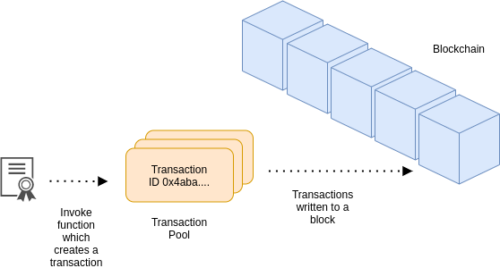

# Blockchain components

This section introduces the components of [blockchains](index.md).

## Nodes

Blockchains are decentralized, which means that they store data across a network of members who collaborate to monitor
and run the network.
Blockchain participants run a blockchain client, such as GoQuorum, and connect it to the network as a *node*.

## Consensus

To ensure that transactions are written to the chain, and that there is agreement on the data and state of the network,
blockchains use a *consensus* mechanism that is a fault-tolerant.
Consensus mechanisms include:

* Proof of work (PoW) - PoW is a consensus mechanism used in Bitcoin that is both time- and computation-intensive.
  PoW blocks are created by nodes called *miners*.
* Proof of authority (PoA) - PoA involves a set of trusted nodes that validate transactions and create blocks.
  These trusted nodes are called *validators*, and other nodes in the network are called *non-validating nodes*.
  Non-validating nodes still validate the blocks that the validators create, but they don't produce them.

GoQuorum supports the PoA algorithms IBFT, QBFT, Raft, and Clique.

## Smart contracts

*Smart contracts* provide controlled access and a range of functions (such as querying, transacting, and updating state)
to blockchain users.
Smart contracts encapsulate data and keep it consistent across the network.
They can allow or restrict participants from executing certain functions, and can restrict access to the network itself.
Smart contracts are written in Solidity (the most popular smart contract language), Vyper, and Serpent.

## Dapps

*Decentralized applications (dapps)* are just like any other software application can be on a website or mobile app.
Dapps are built on a decentralized network (Ethereum) and interact with smart contracts deployed to the network.
They can be thought of as a GUI (front end) for a smart contract (back end), and can be written in any language (for example,
JavaScript).

## Permissioning

[*Permissioning*](../permissions-overview.md) involves a
distributed network of trust across a blockchain network, in which participants agree to follow certain rules.
If one bad actor doesn't follow the rules other nodes can restrict the bad actor from writing to the blockchain.

GoQuorum has support for node permissioning and account permissioning, allowing only specific nodes and accounts to\
access the network.

## Privacy

In a blockchain network, [*privacy*](../privacy/index.md) refers to
the ability to keep transactions private between the involved participants.
Often in a consortium network, some of the participants prefer to restrict how much information they share or who they
transact with.
In other cases, this may not be a concern at all.

GoQuorum supports privacy using a *private transaction manager (PTM)* paired to your member node, typically
Tessera
Tessera uses an enclave for cryptographic functionality and stores and allows access to encrypted transaction data, and
exchanges encrypted payloads with other Tessera nodes.
Tessera is restful/stateless and can be load balanced easily.

## Forks

*Forks* are splits in the blockchain network, or mechanisms to add functionality ([EIPs](https://eips.ethereum.org/)) to
the blockchain protocol from a community-agreed-upon block.

*Hard forks* are radical changes to the network that may change the validity of a block (or a certain chain of blocks).
Hard forks require all nodes to upgrade to the latest version of the client.
These are permanent deviations from the main chain.
