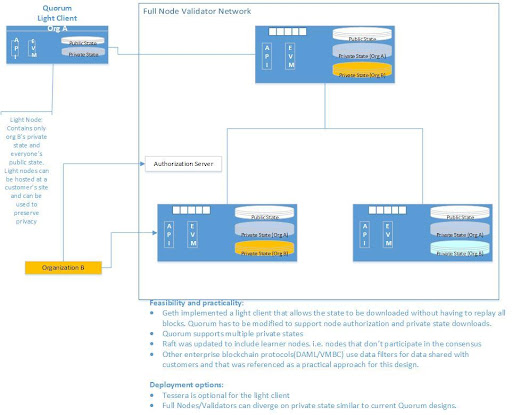

# GoQuorum light node

A standard GoQuorum node will process all blocks and associated transactions.
This can require significant resources and may make it more difficult to scale networks.
Additionally, since the node processes all transactions, privacy concerns could be raised by business partners.

A Quorum light node can be deployed to reduce the amount of data that is available and that is shared by the full nodes with external parties.

Light nodes have specific differences from standard quorum nodes, they:

- Do not process blocks, relying instead on a state synchronization process.
  - In order to support APIs like getTransaction/getBlock the light node will still download the chain data (blocks).
  - The node will also download the receipts from the “server” node.
- Depend on a multi-tenancy (MT) node for receiving a copy of the state. The state is validated during download (i.e it has to be a valid Merkle Tree).
- Will connect to the MT server node only. No other nodes are communicated with.
- Do not require a transaction manager, since both the private and the public state are downloaded from the MT node.
- Act as a proxy for transactions, perform minimal validation. API calls like `SendTansaction`/`SendRawTransaction`/`StoreRaw` are forwarded to the server node.
- Have the same RPC APIs that are required for dApps, delegating calls to the MT node if needed.

If the light node is halted, then on restart it will resync with any state & receipts that were missed whilst it was not running.

## Terminology

- "qlight client": This refers to the light node.
- "qlight server": This refers to a full node that is configured to supply state information to the qlight client. It also handles API requests that are delegated from the qlight client.

## Architecture

## Communication protocol

A peer-to-peer protocol is implemented for communication between the qlight client and server.

### Security

A number of security features are available for the qlight protocol:
- TLS encryption: to ensure the security of data in private transactions.
- Network restriction: restricts communication to specified IP networks (CIDR masks).
- File based permissioning: allows qlight peers to be checked against a permissioned list and a disallowed list.

## Synchronisation process

When a qlight client node is set up, it synchronises state from the server node.
--->>> need a description of this process <<<---

The qlight node has the option to start/initialize from block X (which can be passed in as an initialization parameter).
During initialization the node downloads the public and private state from block height X.
The historic event/receipts data from block 0 to block X are ignored, and will not be available on the qlight node.

Once initialization has completed, the qlight node subscribes to notifications of new blocks. When such notifications are received, the qlight node requests the following from the server node:
- block data
- public/private state delta
- receipts
The qlight node updates the local storage and awaits further block notifications.

## Private transaction manager cache

The qlight client does not have a local Private Transaction Manager (PTM), but relies on the qlight server to supply private data.
This is implemented by means of a local cache which simulates a local PTM.

## New API methods

- admin.qnodeInfo
- admin.qpeers
