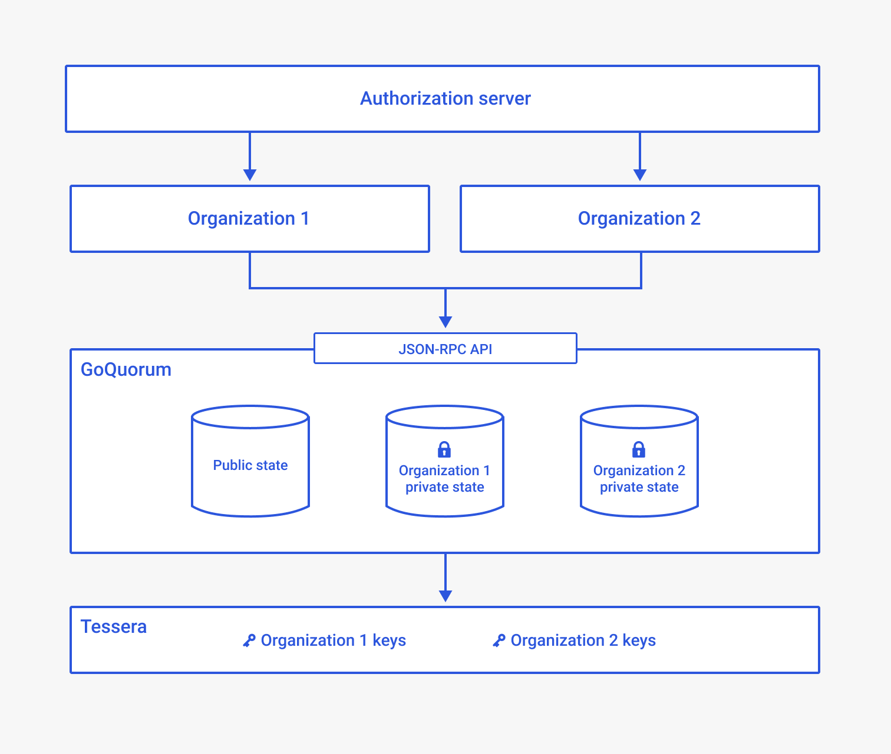

# Multi-tenancy via multiple private states

In a typical GoQuorum network, each participant (tenant) uses its own GoQuorum and Tessera node.
Tessera can be configured to manage multiple key pairs owned by one tenant.
This model is costly to run and scale as more tenants join the network.

[Use multi-tenancy via multiple private states (MPS)](../configure-and-manage/manage/multi-tenancy/multi-tenancy.md) to allow multiple
tenants to use the same GoQuorum node, with each tenant having its own private state(s).
Each tenant can perform all operations (create, read, and write) on any contract in its private state, and a single
tenant can have access to [multiple private states](#multiple-private-states).
Multi-tenancy provides a user experience similar to a user running their own managed node.

The public state remains publicly available to all tenants, and private states are logically separated.

## Architecture



In this example architecture, an organization represents a tenant with multiple departments, and users within the departments.
Each tenant operates on its own private state.
Each user in an organization owns one or more privacy manager key pairs that allow them to operate on their
organization's private state.
A network operator administers entitlements and private state access for each organization using the authorization server.

[JSON-RPC security](../develop/json-rpc-apis.md) features are used to manage a user's access to a private state.
The [authorization server](#enterprise-authorization-server) controls this access.

## Network topology

A network can consist of multi-tenant nodes and single-tenant nodes.
One or more independent [authorization servers](#enterprise-authorization-server) can be used to protect multi-tenant
nodes, but one multi-tenant node can only be protected by one authorization server.

## Enterprise authorization server

To support multi-tenancy, you must configure an authorization server, such as [ORY Hydra](https://github.com/ory/hydra)
or [Okta](https://developer.okta.com/).
The authorization server can grant private state access to clients via a [private state identifier (PSI)](#private-state-identifier).

### Access token scope

The [JSON-RPC security plugin](../develop/json-rpc-apis.md) enables the `geth` JSON-RPC API server to be an
OAuth2-compliant resource server.
A client must first obtain a pre-authenticated access token from an authorization server, then present the access token
(using an `Authorization` HTTP request header) when calling an API.
Calls to the GoQuorum API without an authenticated token are rejected.

The value of the scope encoded in an access token (in case of JWT), or Introspection response (in the case of the OAuth2
Token Introspection API) contains the [RPC scope](../reference/plugins/security.md#oauth2-scopes) and tenant scope,
which has the following URL-based syntax:

```text
"psi://[PSI]?self.eoa=0x0&node.eoa=0x0"
```

In the syntax, `PSI` is the URL-encoded value of the PSI.

For example, for a client that has access to two private states `PS1` and `PS2`, an authorization server operator sets
up and grants the following scopes to the client:

```text
"psi://PS1?self.eoa=0x0&node.eoa"
"psi://PS2?self.eoa=0x0&node.eoa"
```

A client presenting an access token containing these scopes has full access (read/write/create) to private contracts on
private states `PS1` and `PS2` using any Ethereum accounts.

## Multiple private states

Multiple private states (MPS) is a feature that allows a GoQuorum node to manage more than one private state.
This functionality lays the foundation for multi-tenancy.

If running GoQuorum version `21.4.1` or earlier or Tessera version `21.1.1` or earlier, [upgrade your existing nodes to
enable MPS](../configure-and-manage/manage/multi-tenancy/migration.md).

### Private state identifier

A private state is identified by a sequence of bytes, referred to as the PSI (private state identifier).
The PSI is used to determine the specific private state a user can operate on.

### Trie of private states

A trie of private states keeps track of all private states managed by a node.
The PSI is the key in the trie that maps to the root hash of the corresponding private state.

At each block:

1. All affected private states are updated and their new root hashes are calculated.
1. The trie is updated with the new private state root hashes at their PSIs.
1. A new root of the trie of private states is calculated and mapped to the public block hash.

### Private state manager

The GoQuorum private state manager resolves the [PSI](#private-state-identifier) based on input parameters.

Any RPC API call must be accompanied by a PSI or authorization token.
From the token, the private state manager derives the private state the user is attempting to access.

### Tessera resident groups

MPS uses [Tessera resident groups](/Concepts/Privacy-Groups/) to map tenants
to private states.
During Tessera startup, `residentGroups` are validated to check each Tessera key is part of a single resident group.
Every Tessera key must be in a resident group for Tessera to start.
During GoQuorum startup, the `residentGroups` are [retrieved from Tessera](#tessera-q2t-communication-changes) and kept
in memory in GoQuorum.

### Tessera Q2T communication changes

The `/groups/resident` QT2 endpoint returns the resident groups defined in Tessera.
This endpoint is invoked at GoQuorum startup to retrieve all resident groups.
These details are kept in memory in GoQuorum, so the [private state manager](#private-state-manager) can resolve these
resident groups to the corresponding private state.

### Accessing a private state

Users must specify the private state they wish to operate on.
For backwards compatibility, if a user connects without specifying the private state, the default `private` identifier is used.
If a private state is not configured, the user operates on an empty read-only private state.

In order of precedence, users have the following three options to specify a private state to operate on:

1. URL parameter. PSI query parameter can be added to the API URI:

    ```bash
    geth attach http://localhost:22000/?PSI=PS1
    ```

1. HTTP header. Every RPC request must have an HTTP header "PSI" attached that specifies the private state to use.

1. IPC and inproc connections. Prepend the PSI to the ID field of the `jsonrpcMessage`.

### Accessing a private state using web3j

To access a private state using [web3j](https://github.com/web3j/web3j), specify the query parameter in the URL when initializing the `HttpService`. If you have authentication enabled you must specify a bearer token in the `Authorization` header.

```java
HttpService service = new HttpService("https://secure_endpoint?PSI=$PSI");
service.addHeader("Authorization", "bearer $accessToken");

quorum = Quorum.build(service);
```
