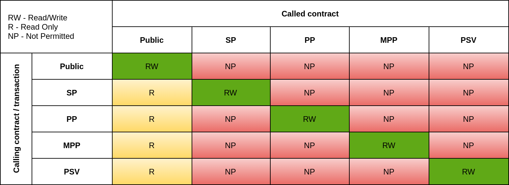

# Privacy enhancements

In addition to [standard privacy (SP)](private-and-public.md#private-transactions), GoQuorum provides three kinds of
privacy enhancements:

* [Counter-party protection (PP)](#counter-party-protection)
* [Mandatory party protection (MPP)](#mandatory-party-protection)
* [Private state validation (PSV)](#private-state-validation)

## Counter-party protection

Counter-party protection prevents non-participants from interacting with a private contract, without using access controls.

For example, a private contract is deployed between nodes 1 and 2.
Without counter-party protection, if node 3 discovers the private contract address, it can send a transaction with
`privateFor` set to node 2.
The transaction isn't applied to node 3's private state because node 3 isn't a participant in the private transaction,
but the transaction is applied to node 2's private state.

To enable counter-party protection, [enable enhanced privacy](#enabling-privacy-enhancements) and set `privacyFlag` to 1
when using [`send` API methods](../../reference/api-methods.md#privacy-methods).

## Mandatory party protection

Mandatory party protection inherits all features of counter-party protection, and also allows you to define one or more
recipients as mandatory for a private contract.
The mandatory recipient is included in all subsequent transactions to the contract and has full private state,
while normal recipients may only have partial state of the contract.

Use mandatory party protection if you need governing or central nodes to have full private state for any contracts
deployed in the network.

To enable mandatory party protection, [enable enhanced privacy](#enabling-privacy-enhancements) and set `privacyFlag` to
2 and the `mandatoryFor` parameter to a list of mandatory recipients when using
[`send` API methods](../../reference/api-methods.md#privacy-methods).

## Private state validation

Private state validation prevents state divergence by ensuring that any private transaction for the contract is always
sent to all participants.

For example, a private contract is deployed between nodes 1 and 2.
Without private state validation, node 1 can send a transaction to the private contract with a `privateFor` of `[]`.
The transaction changes the private state of node 1 but not node 2, and the private states of 1 and 2 no longer match.
With private state validation, a transaction from node 1 with a `privateFor` of `[]` is rejected and the transaction is
processed only when `privateFor` contains both 1 and 2.

Private state validation shares the full participant list among all participants, and validates against all
subsequent transactions.
Transactions sent to a subset of participants fail.

In standard privacy or when only using [counter-party protection](#counter-party-protection), only the sender knows the
full participant list.

To enable private state validation, [enable enhanced privacy](#enabling-privacy-enhancements) and set `privacyFlag` to 3
when using [`send` API methods](../../reference/api-methods.md#privacy-methods).

## Using privacy enhancements

### Limitations

Depending on the complexity of the contracts and the throughput of the network, the state at simulation time may differ
from the chain state at the time the proposed transaction is published.
If the state at publishing time is changed from simulation time, the corresponding PP, MPP, and PSV transactions fail on
all participants.
Furthermore, since state divergence is expected in PP and MPP contracts, it's possible (depending on contract design)
for PP and MPP transactions to fail on some participants.

Concurrency may also present a problem for PSV contracts.
The execution hash calculation is based on the chain state at simulation time.
Submitting multiple transactions to the same PSV contract from multiple nodes concurrently may result in most of the
transactions failing.

!!! important

    Because of these limitations, use privacy-enhanced transactions only when the enhanced privacy is necessary and the
    extra privacy benefits outweigh the potential shortfalls.

### Transaction interactions

No interactions are allowed between the different types of private transactions.
The only allowed interaction is for private contracts (SP, PP, MPP, and PSV) to read from public contracts.

The privacy enhancements feature only performs its checks on published transactions.
None of the [limitations](#limitations) apply to calls (read only transactions); calls are contract method invocations
executed locally and don't result in published transactions.

### Enabling privacy enhancements

To enable privacy enhancements in Tessera, set the `enablePrivacyEnhancements` parameter in the
[Tessera configuration file]({{ extra.othersites.tessera }}/Reference/SampleConfiguration/) to `true`.
To enable privacy enhancements in GoQuorum, set the `privacyEnhancementsBlock` in the GoQuorum
[genesis file](../../configure-and-manage/configure/genesis-file/genesis-options.md) `config` object to a future block, when the entire network is
ready to transact with privacy-enhanced transactions.
All GoQuorum nodes in the network must be initialized with the same `privacyEnhancementsBlock` value.

!!! note

    You need to re-run `geth init` when you update the genesis file to incorporate the changes. This does not delete or modify any current sync process or saved blocks.

You can disable `enablePrivacyEnhancements` in the Tessera configuration if your GoQuorum node is not ready to support privacy enhancements.
This allows the GoQuorum node to reject PP, MPP, and PSV transactions from other nodes until the node is ready to support
privacy-enhanced transactions.

### Backward compatibility

An upgraded GoQuorum node can coexist on a network where other nodes are running earlier GoQuorum versions.
However, it can't support privacy-enhanced contracts until all interested nodes are upgraded and enable privacy.

!!! important

    If an upgraded but non-privacy-enabled GoQuorum node receives a PP, MPP, or PSV transaction, the node logs a `BAD
    BLOCK` error.
    If the consensus algorithm is Raft, the node stops.
    If the consensus algorithm is IBFT or QBFT, the node keeps trying to add the bad block, and reprints the errors.
    It won't catch up with rest of nodes until restarted and reinitialized with the correct `privacyEnhancementsBlock`.

If you set the `enablePrivacyEnhancements` flag to `true` in Tessera without enabling privacy in GoQuorum, the node can
crash, as the Tessera node accepts PP, MPP, and PSV transactions.

An upgraded Tessera node can continue to communicate with Tessera nodes running on previous versions using SP transactions.

*[PP]: Counter-Party Protection
*[MPP]: Mandatory Party Protection
*[PSV]: Private State Validation
*[SP]: Standard Private
