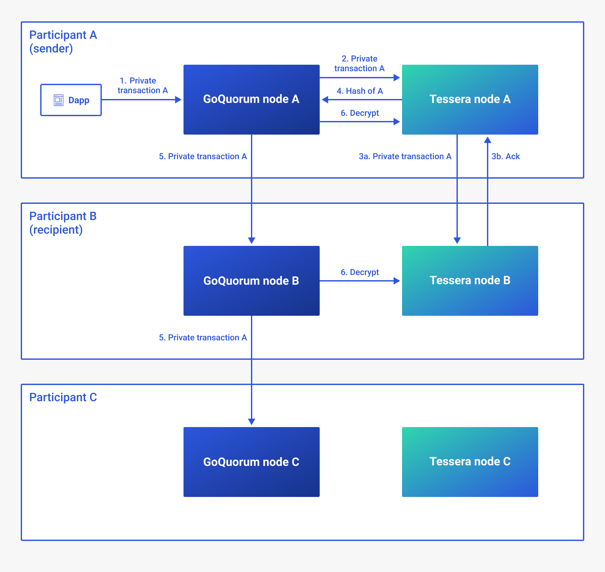
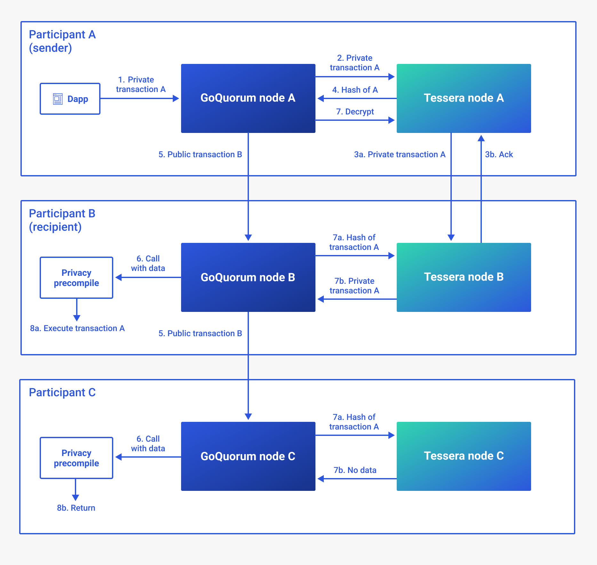

# Private transaction lifecycle

This topic illustrates the high-level lifecycle of normal [private transactions](private-and-public.md#private-transactions) and [privacy marker transactions (PMTs)](privacy-marker-transactions.md).

In both examples, participants A and B are party to the transaction and participant C is not.

## Normal private transactions

1. Participant A sends a private transaction to their GoQuorum node A.
1. GoQuorum serializes the private transaction `data` value to JSON and sends it to Tessera node A with participant details.
1. Tessera encrypts the `data` and distributes it to transaction participants.
1. Tessera returns the hash of the encrypted `data` to GoQuorum node A. GoQuorum replaces the private transaction `data` value with the hash. GoQuorum signs the private transaction and sets the `v` value to `37` or `38` to mark the transaction as private.
1. GoQuorum distributes the private transaction throughout the network.
1. All nodes can see the transaction. Only transaction participants (participants A and B) can get the decrypted data from Tessera and execute the transaction.

## Privacy marker transactions

1. Participant A sends a private transaction to their GoQuorum node A.
1. GoQuorum serializes the private transaction `data` value to JSON and sends it to Tessera node A with participant details.
1. Tessera encrypts the `data` and distributes it to transaction participants.
1. Tessera returns the hash of the encrypted `data` to GoQuorum node A. GoQuorum creates a public PMT with the `data` field set to the hash. GoQuorum signs the PMT.
1. GoQuorum distributes the PMT throughout the network. All nodes can see the PMT.

   The PMT is processed in the same way as a standard public transaction. Since the PMT's `to` value is the address of the privacy precompile contract, that contract is called.

1. GoQuorum nodes B and C call the privacy precompile with the PMT `data`.
1. GoQuorum attempts to retrieve the decrypted private transaction from Tessera using the publicly available hash from the PMT.
1. Action depends on whether the node is a transaction participant:

   1. Participant: GoQuorum gets the decrypted `data` of the private transaction from Tessera and the privacy precompile executes the private transaction.

   1. Non-participant: No private transaction is found, so the privacy precompile returns immediately.
