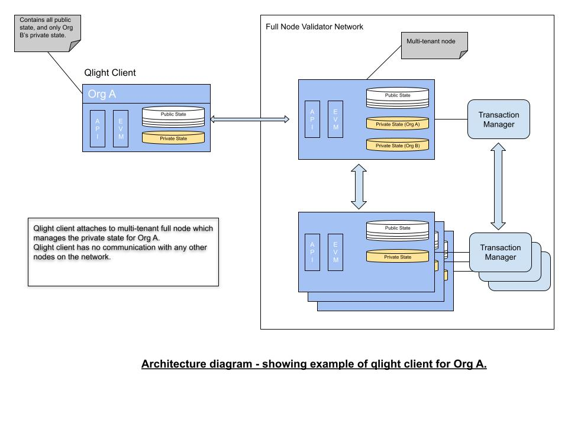

# GoQuorum qlight node

A qlight node is a lightweight replica of a full node that proxies transactions to the full node.
You can [configure a qlight node](../configure-and-manage/configure/qlight-node.md) to reduce the amount of data that is shared with external parties by the full nodes.

The qlight node can be used to:

- Avoid impacting main nodes which are processing transactions with anything that could thrash the API (such as monitoring, state querying, or other intensive processes).
- Prevent security concerns where the main node is handling multiple private parties [(multi-tenancy)](multi-tenancy.md).
  The qlight client deals with a private state for one party only, and only that user has access to the qlight client.

## Qlight nodes and standard nodes

A standard GoQuorum node processes all blocks and associated transactions.
It also requires a local [private transaction manager](privacy/index.md#private-transaction-manager) to handle private data.
This can require significant resources and can make it more difficult to scale networks.
Additionally, since the node processes all transactions, privacy concerns could be raised by business partners.

Using a qlight node for process-intensive tasks can help lessen impact to the performance of a main node.
Qlight nodes help prevent network throttling due to third party network limits,
or multiple clients all hitting the same main node.

Qlight nodes differ from standard quorum nodes in the following ways:

- Qlight nodes depend on a server full node for receiving data and will only connect to the server node.
  There is no communication with any other node.

- They only receive blocks from the server node, processing them locally to build up the public and private state.

- They do not require a transaction manager. Instead, private data is sent directly by the server node via the qlight P2P protocol.

- They act as a proxy for locally submitted transactions, performing minimal validation.
  API calls like `SendTansaction`/`SendRawTransaction`/`StoreRaw` are forwarded to the server node for processing.

- They use the same RPC APIs that are required for dapps, delegating calls to the server node if needed.

- They do not partake in the consensus mechanism.

## Client and server

- *qlight client* refers to the qlight node.

- *qlight server* refers to a full node that is configured to supply data to the qlight client.
  It also handles API requests that are delegated from the qlight client.

## Architecture

## Communication protocol

The qlight client and server communicate through a peer-to-peer protocol.

### Security

A number of security features are available for the qlight client-server connection:

- Native transport layer security (TLS): this can be used to encrypt communications and ensure the security of private transaction data.
- Network restriction: restricts communication to specified IP networks (CIDR masks).
- File based permissioning: allows qlight peers to be checked against a permissioned list and a disallowed list.
- Enterprise authorization protocol integration: this allows qlight clients to be authenticated using an OAuth2 server.

## Private transaction manager cache

The qlight client does not have a local [private transaction manager](../concepts/privacy/index.md#private-transaction-manager),
but relies on the qlight server to supply private data.
This is implemented by means of a local cache which simulates a local private transaction manager.
Therefore, private transactions can be executed locally, with the private data being fetched from the private transaction manager cache.

## New API methods (on qlight server)

- `admin.qnodeInfo`: Returns details of the qlight configuration.
- `admin.qpeers`: Returns details of the qlight clients that are connected.
