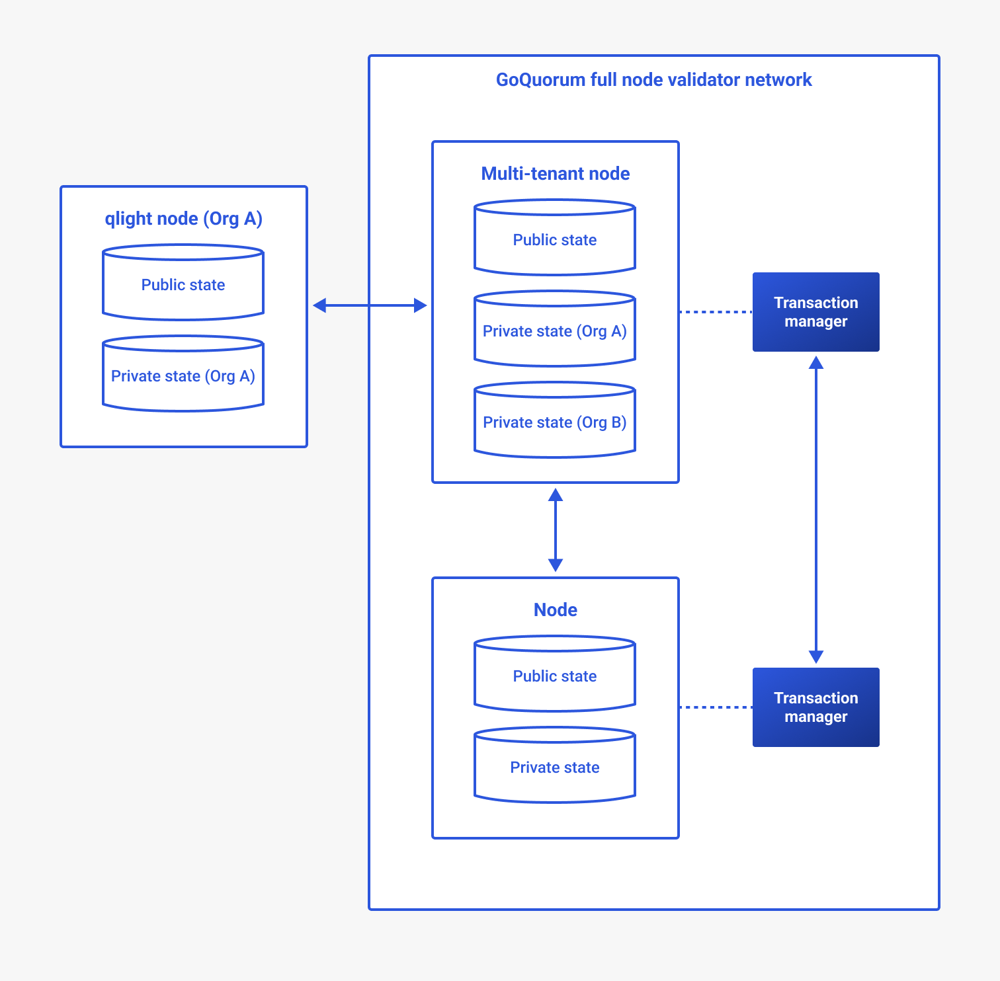

# GoQuorum qlight

A qlight node is a lightweight replica of a full node that proxies transactions to the full node.
You can [configure a qlight node](../configure-and-manage/configure/qlight-node.md) to reduce the amount of data shared
with external parties by the full nodes.

You can use a qlight node to:

- Avoid impacting transaction-processing main nodes with anything that could thrash the API (such as monitoring, state
  querying, or other intensive processes).
- Prevent security concerns where the main node is handling multiple private parties ([multi-tenancy](multi-tenancy.md)).
  The qlight client deals with a private state for one party only, and only that user has access to the qlight client.

## Standard nodes and qlight nodes

A standard GoQuorum node processes all blocks and associated transactions.
It also requires a local [private transaction manager](privacy/index.md#private-transaction-manager) to handle private data.
This can require significant resources and make it more difficult to scale networks.
Also, since the node processes all transactions, this can raise privacy concerns.

Using a qlight node for process-intensive tasks can help improve the performance of a main node.
qlight nodes help prevent network throttling due to third party network limits, or multiple clients all hitting the same
main node.

Unlike standard GoQuorum nodes, qlight nodes:

- Depend on a server full node for receiving data and only connect to the server node.
  There's no communication with any other node.

- Only receive blocks from the server node, processing them locally to build up the public and private state.

- Don't require a transaction manager.
  Instead, private data is sent directly by the server node via the qlight P2P protocol.

- Act as a proxy for locally submitted transactions, performing minimal validation.
  API calls such as `SendTansaction`/`SendRawTransaction`/`StoreRaw` are forwarded to the server node for processing.

- Use the same RPC APIs required for dapps, delegating calls to the server node if needed.

- Don't participate in the consensus mechanism.

## Client and server

- *qlight client* refers to the qlight node.

- *qlight server* refers to a full node configured to supply data to the qlight client.
  It also handles API requests that are delegated from the qlight client.

## Architecture

## Communication protocol

The qlight client and server communicate through a peer-to-peer protocol.

### Security

The following are security features available for the qlight client-server connection:

- [Native transport layer security (TLS)](../configure-and-manage/configure/qlight-node.md#configure-tls-for-p2p-communication) -
  Encrypts communications and ensures the security of private transaction data.
- [Network restriction](../configure-and-manage/configure/qlight-node.md#network-ip-restriction) - Restricts
  communication to specified IP networks (CIDR masks).
- [File based permissioning](../configure-and-manage/configure/qlight-node.md#file-based-permissioning) - Allows qlight
  peers to be checked against a permissioned list and a disallowed list.
- [Enterprise authorization protocol integration](../configure-and-manage/configure/qlight-node.md#configure-enterprise-authorization) -
  Allows qlight clients to be authenticated using an OAuth2 server.

## Private transaction manager cache

The qlight client doesn't have a local [private transaction manager](../concepts/privacy/index.md#private-transaction-manager),
but relies on the qlight server to supply private data.
This is implemented using a local cache that simulates a local private transaction manager.
Private transactions can be executed locally, with the private data being fetched from the private transaction manager cache.

## API methods (on qlight server)

- `admin.qnodeInfo` - Returns details of the qlight configuration.
- `admin.qpeers` - Returns details of the connected qlight clients.
