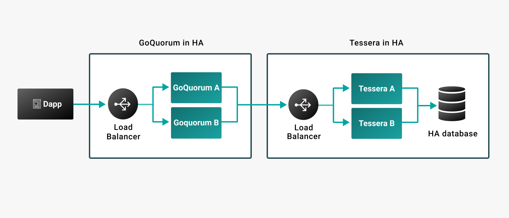

# GoQuorum high availability

You can configure GoQuorum for end-to-end high availability (HA). This section covers the HA
configuration requirements for GoQuorum and Tessera.

## GoQuorum HA configuration requirements

- Two or more GoQuorum nodes serve as one client via a load balancer which handles incoming requests.
- The GoQuorum nodes must share the same private transaction manager public key for transaction
    signing, and must have shared access to the key store directory or key vaults.
- The GoQuorum nodes must share the same private state. They can connect to a local Tessera node,
    or highly available Tessera nodes via a load balancer.
- The GoQuorum nodes must have different node keys.

## Tessera HA configuration requirements

- Two or more Tessera nodes serve as the privacy manager for a GoQuorum node.
- The Tessera nodes share the same public and private key pair in password protected files or
    external vaults.
- The [Quorum-to-Tessera (Q2T) server configuration] uses HTTP or HTTPS.
- The Tessera nodes share the same database.

    !!! important

        We recommend using a relational database that is configured for HA. If you are maintaining
        the database yourself, ensure mirroring is set up, and the supplied JDBC url includes the
        failover connection details. In a cloud environment this is taken care of by the providers;
        we recommend using AWS RDS or Azure Database.

[Quorum-to-Tessera (Q2T) server configuration]: /HowTo/Configure/TesseraAPI
