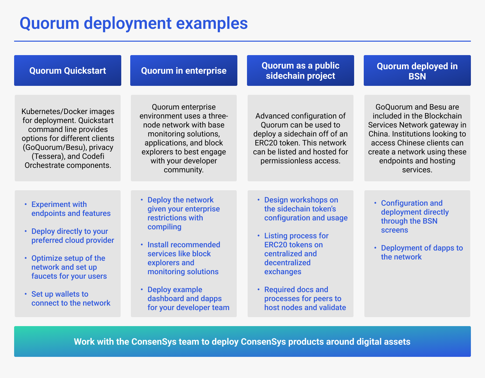

# Deployment overview

The GoQuorum Ethereum client is part of the [ConsenSys Quorum](https://consensys.net/quorum/) platform.
The following are examples of Quorum deployments.

For more information about Quorum deployment options, [contact Quorum support](https://consensys.net/quorum/subscription/).

You can [get started with GoQuorum](install/getting-started-overview.md).
