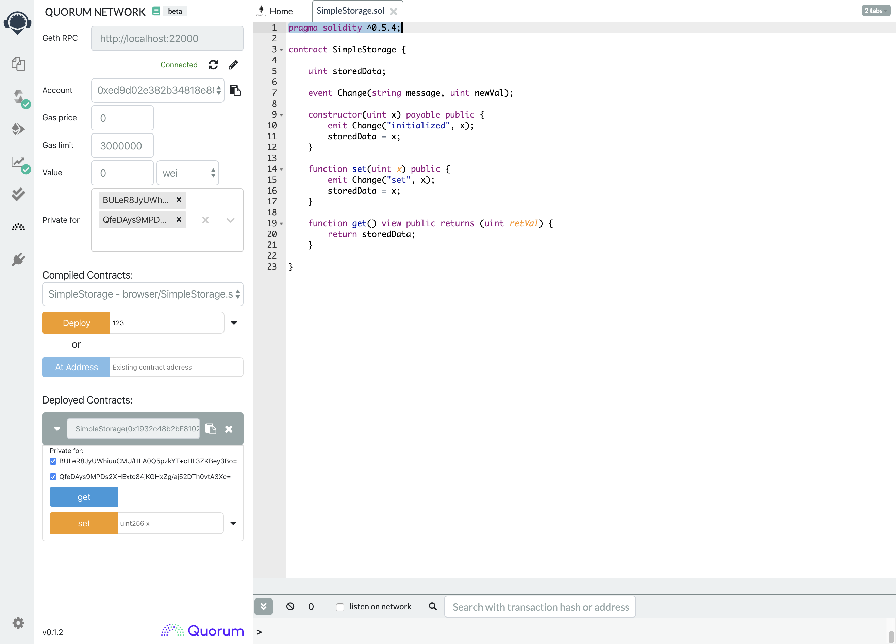
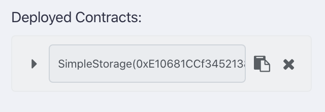

# GoQuorum plugin for Remix

The GoQuorum plugin for Ethereum's [Remix IDE](https://remix.ethereum.org) adds support for creating and interacting with
private contracts on a GoQuorum network.

## Using the Quorum plugin for Remix

1. Go to the [Remix IDE](https://remix.ethereum.org).
  From the left menu select the **Plugin manager** tab, scroll down to **Quorum Network**, and **Activate**.

    

1. Accept the permission to allow the plugin to retrieve compilation results.
  This allows the plugin to use the Solidity compiler to get the compiled contract binary to deploy to your GoQuorum node.

    

1. The plugin should now be included in the icons on the left side.
  Click on the Quorum icon to show the plugin.

    

1. Input the geth RPC URL and hit enter.
  If you are currently running the `quorum-examples` 7nodes network, the first node's URL is [`http://localhost:20000`](http://localhost:20000).

    

1. If the node is running, the plugin says **Connected** and the rest of the UI appears.

    

1. The GoQuorum plugin uses results from Remix's Solidity compiler, so pull up some contract code and compile it as you
  normally would in Remix.
  The plugin will automatically receive the compiled code on each new compilation.

1. Once you have a contract compiled, it will automatically be selected in the **Compiled Contracts** dropdown.
  Input any constructor values and deploy.

    

1. If successful, the contract will show up in a collapsed view under **Deployed Contracts**.
  Click the caret to expand.

    

1. From here you can call methods on the contract.

    

1. To create a private contract, add your Tessera public keys one at a time to the **Private for** multi-select box.
  Press enter after inputting each one to save and select.

    

1. Add as many peers as you want, then deploy the contract again as in step 7.

    

1. After deploying and expanding the new contract, you should see the public keys that you selected in the widget.
  Every method call will include the selected keys automatically.

    

If you have any feedback or questions, please open a GitHub issue or reach out on [GoQuorum Slack](https://inviter.quorum.consensys.net/).

## Contributing

The GoQuorum plugin for Remix is open source and you can contribute enhancements.
Upon review of your changes you're required to complete a Contributor License Agreement (CLA) before merging.
If you have any questions about the contribution process, please [email the Quorum team](mailto:quorum@consensys.net).
