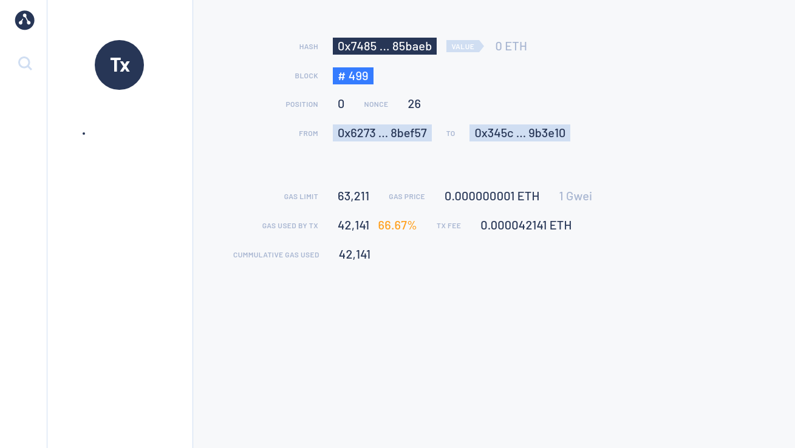

# Use Quorum Developer Quickstart

The Quorum Developer Quickstart uses the GoQuorum Docker image to run a private
[IBFT](../../configure-and-manage/configure/consensus-protocols/ibft.md) network of GoQuorum nodes managed by Docker Compose.

!!! important
    This tutorial runs a private network suitable for education or demonstration purposes
    and is not intended for running production networks.

## Prerequisites

* [Node.js and NPM](https://docs.npmjs.com/downloading-and-installing-node-js-and-npm) version 14 or higher
* [Docker and Docker-compose](https://docs.docker.com/compose/install/)
* [Truffle](https://www.trufflesuite.com/truffle) development framework
* [`curl` command line](https://curl.haxx.se/download.html)
* [MetaMask](https://metamask.io/)

!!! important
    Allow Docker up to 4G of memory or 6G if running the privacy examples.
    Refer to the **Resources** section in [Docker for Mac](https://docs.docker.com/docker-for-mac/) and
    [Docker Desktop](https://docs.docker.com/docker-for-windows/) for details.

## Generate the tutorial blockchain configuration files

To create the tutorial `docker-compose` files and artifacts, run:

```bash
npx quorum-dev-quickstart
```

Follow the prompts displayed to run GoQuorum and [logging with ELK](../../configure-and-manage/monitor/elastic-stack.md).
Enter `n` for [Codefi Orchestrate](https://docs.orchestrate.consensys.net/en/stable/) and `y` for
[private transactions](../../concepts/privacy/index.md).

## Start the network

To start the network, go to the installation directory (`quorum-test-network` if you used the default value) and run:

```bash
./run.sh
```

The script builds the Docker images, and runs the Docker containers.

Four GoQuorum IBFT validator nodes and a non-validator node are created to simulate a base network.
In addition, there are three member pairs (GoQuorum and Tessera sets) to simulate private nodes on the network.

When execution is successfully finished, the process lists the available services:

!!! example "Services list"

    ```log
    *************************************
    Quorum Dev Quickstart
    *************************************
    ----------------------------------
    List endpoints and services
    ----------------------------------
    JSON-RPC HTTP service endpoint                 : http://localhost:8545
    JSON-RPC WebSocket service endpoint            : ws://localhost:8546
    Web block explorer address                     : http://localhost:25000/
    Prometheus address                             : http://localhost:9090/graph
    Cakeshop toolkit address                       : http://localhost:8999
    Grafana address                                : http://localhost:3000/d/a1lVy7ycin9Yv/goquorum-overview?orgId=1&refresh=10s&from=now-30m&to=now&var-system=All

    For more information on the endpoints and services, refer to README.md in the installation directory.
    ****************************************************************
    ```

* Use the **JSON-RPC HTTP service endpoint** to access the RPC node service from your dapp or from
  cryptocurrency wallets such as MetaMask.
* Use the **JSON-RPC WebSocket service endpoint** to access the WebSocket node service from your
  dapp.
* Use the [**Web block explorer address**](http://localhost:25000) to display the block explorer web application.
* Use the [**Prometheus address**](http://localhost:9090/graph) to access the Prometheus dashboard
    and [monitor nodes and view metrics](../../configure-and-manage/monitor/metrics.md).
* Use the [**Grafana address**](http://localhost:3000/d/a1lVy7ycin9Yv/goquorum-overview?orgId=1&refresh=10s&from=now-30m&to=now&var-system=All)
    to access the Grafana dashboard to [monitor nodes and view metrics](../../configure-and-manage/monitor/metrics.md).
* Use the [**Kibana logs address**](http://localhost:5601/app/kibana#/discover) to
  [access and manage logs in Kibana](../../configure-and-manage/monitor/elastic-stack.md).

To display the list of endpoints again, run:

```bash
./list.sh
```

## Use a block explorer

The quickstart supports a modified version of the [Alethio Ethereum Lite Explorer](#alethio-ethereum-lite-explorer)
and [BlockScout](#blockscout).

### Alethio Ethereum Lite Explorer

Access the [Alethio Ethereum Lite Explorer](https://github.com/Alethio/ethereum-lite-explorer) at
[`http://localhost:25000`](http://localhost:25000) as displayed when starting the private network.

The block explorer displays a summary of the private network, indicating four peers.

Click the block number to the right of **Best Block** to display the block details:


You can explore blocks by clicking on the blocks under **`Bk`** on the left-hand side.

You can search for a specific block, transaction hash, or address by clicking the :mag: in the top left-hand corner.


### BlockScout

At the prompt **Do you wish to enable support for monitoring your network with BlockScout?**, enter `Y` to start
BlockScout at [`http://localhost:26000`](http://localhost:26000).

!!! note

    BlockScout's Docker image is resource heavy when running.
    Ensure you have adequate CPU resources dedicated to the container.

The [quickstart BlockScout configuration](https://github.com/ConsenSys/quorum-dev-quickstart/blob/master/templates/goquorum/docker-compose.yml)
is available as a reference for your own network.

## Monitor nodes with Prometheus and Grafana

The sample network also includes Prometheus and Grafana monitoring tools to let you visualize
node health and usage.
You can directly access these tools from your browser at the addresses displayed in the endpoint list.

* [Prometheus dashboard](http://localhost:9090/graph).
* [Grafana dashboard](http://localhost:3000/d/a1lVy7ycin9Yv/goquorum-overview?orgId=1&refresh=10s&from=now-30m&to=now&var-system=All).

For more details on how to configure and use these tools for your own nodes, see our
[performances monitoring documentation](../../configure-and-manage/monitor/metrics.md),
the [Prometheus documentation](https://prometheus.io/docs/introduction/overview/)
and [Grafana documentation](https://grafana.com/docs/).


## Run JSON-RPC requests

You can run JSON-RPC requests on:

* HTTP with `http://localhost:8545`.
* WebSockets with `ws://localhost:8546`.

### Run with `curl`

This tutorial uses [`curl`](https://curl.haxx.se/download.html) to send JSON-RPC requests over HTTP.

### Request the node version

Run the following command from the host shell:

```bash
curl -X POST --data '{"jsonrpc":"2.0","method":"web3_clientVersion","params":[],"id":1}' -H 'Content-Type: application/json' http://localhost:8545
```

The result displays the client version of the running node:

=== "Result example"

    ```json
    {
    "jsonrpc" : "2.0",
    "id" : 1,
    "result" : "Geth/node5-istanbul/v1.9.20-stable-1d7926a1(quorum-v21.4.2)/linux-amd64/go1.15.5"
    }
    ```

=== "Result explanation"

    * `"jsonrpc" : "2.0"` indicates that the JSON-RPC 2.0 spec format is used.
    * `"id" : 1` is the request identifier used to match the request and the response. This tutorial always uses 1.
    * `"result"` contains the running GoQuorum information:
        * `v1.9.20-stable-1d7926a1` is the Geth build that has been used for GoQuorum
        * `quorum-v21.4.2` is the running GoQuorum version number. This may be different when you run this tutorial.
        * `linux-amd64` is the architecture used to build this version.
        * `go1.15.5` is the Go version used. This may be different when you run this tutorial.

Successfully calling this method shows that you can connect to the nodes using JSON-RPC over HTTP.

From here, you can walk through more interesting requests demonstrated in the rest of this section,
or skip ahead to [Create a transaction using MetaMask](#create-a-transaction-using-metamask).

### Count the peers

Peers are the other nodes connected to the node receiving the JSON-RPC request.

Poll the peer count using `net_peerCount`:

```bash
curl -X POST --data '{"jsonrpc":"2.0","method":"net_peerCount","params":[],"id":1}' -H 'Content-Type: application/json'  http://localhost:8545
```

The result indicates seven peers (our validators):

```json
{
  "jsonrpc" : "2.0",
  "id" : 1,
  "result" : "0x7"
}
```

### Request the most recent block number

Call `eth_blockNumber` to retrieve the number of the most recently synchronized block:

```bash
curl -X POST --data '{"jsonrpc":"2.0","method":"eth_blockNumber","params":[],"id":1}' -H 'Content-Type: application/json' http://localhost:8545
```

The result indicates the highest block number synchronized on this node.

```json
{
  "jsonrpc" : "2.0",
  "id" : 1,
  "result" : "0x2a"
}
```

Here the hexadecimal value `0x2a` translates to decimal as `42`, the number of blocks received by the node so far,
about two minutes after the new network started.

## Private transactions

This example uses the [web3.js](https://www.npmjs.com/package/web3) library to make the API calls, creating three member
nodes pairs (a GoQuorum node which has a corresponding Tessera node for privacy) that can be accessed using APIs on the following ports:

```bash
Member1Quorum RPC: http://localhost:20000
Member1Tessera: http://localhost:9081

Member2Quorum RPC: http://localhost:20002
Member1Tessera: http://localhost:9082

Member3Quorum RPC: http://localhost:20004
Member1Tessera: http://localhost:9083
```

Navigate to the `smart_contracts` directory and deploy the private transaction:

```bash
cd smart_contracts
npm install
node scripts/private_tx.js
```

This deploys the contract and sends an arbitrary value (`47`) from `Member1` to `Member3`.

Once done, it performs a read operation on the contract using the `get` function and the contract's ABI, at the address specified.

It then performs a write operation using the `set` function and the contract's ABI, at the address and sets the value to `123`.

Lastly, it performs a read operation on all three members to verify that this is private between `Member1` and `Member3`
only, and you should see that only `Member1` and `Member3` return the result of `123`, and `Member2` has an undefined
value.

```bash
node scripts/private_tx.js
The transaction hash is: 0x4d796b2ccac109fc54006105df44c519341696fa88e004ce5c614239cb9f92a2
Address of transaction:  0x695Baaf717370fcBb42aB45CD83C531C27D79eF1
Use the smart contracts 'get' function to read the contract's constructor initialized value ..
Member1 obtained value at deployed contract is: 47
Use the smart contracts 'set' function to update that value to 123 .. - from member1 to member3
Verify the private transaction is private by reading the value from all three members ..
Member1 obtained value at deployed contract is: 123
Member3 obtained value at deployed contract is: 123
Member2 obtained value at deployed contract is: undefined
```

### Inspect the member nodes with `geth attach`

You can inspect any of the GoQuorum nodes by using `attach.sh` to open the geth JavaScript console.

Use a separate terminal window for each of Member1, Member2, and Member3.
In each terminal, go to the main directory where `docker-compose.yml` is located, then:

* In terminal 1, run `./attach.sh 1` to attach to Member1.
* In terminal 2, run `./attach.sh 2` to attach to Member2.
* In terminal 3, run `./attach.sh 3` to attach to Member3.

To view the private transaction, run the following command in one of the terminals:

=== "geth console request"

    ```js
    eth.getTransaction("0x4d796b2ccac109fc54006105df44c519341696fa88e004ce5c614239cb9f92a2"); // replace with your transaction hash
    ```

=== "JSON result"

    ```json
    {
      blockHash: "0x3d69d2eb2a50a96072c549805f0ba04ce364b68ef7c16cd0ddac8e6c184e599e",
      blockNumber: 823,
      from: "0xf0e2db6c8dc6c681bb5d6ad121a107f300e9b2b5",
      gas: 150050,
      gasPrice: 0,
      hash: "0x4d796b2ccac109fc54006105df44c519341696fa88e004ce5c614239cb9f92a2",
      input: "0xe619b9d1469c34735145be181a28d18c09b575ef1a8fdbdcb0fe3934c2de5a8c62814e93b087ee918cfa294a0023aa6d42ef360ccf4997f1b94ae1e6c9145a3a",
      nonce: 6,
      r: "0x2660131d78ccd80773e8094d9fbf7d030f9753ddb1496af5b12f643ba95f900b",
      s: "0x50f3e787595b88e5738adba373971d61394c9710d1a0dbee7287d10085d2fef5",
      to: null,
      transactionIndex: 0,
      v: "0x26",
      value: 0
    }
    ```

!!! note
    The `v` field value of `"0x25"` or `"0x26"` (37 or 38 in decimal) indicates this transaction has a private payload (input).

### Read the contract with `get()`

For each of the three nodes, create a variable called `address` using the geth console, and assign to it the address
of the contract created by Member1.
The contract address can be found:

* In Member1's log file `data/logs/1.log`.
* Using [`eth.getTransactionReceipt(txHash)`](https://web3js.readthedocs.io/en/v1.4.0/web3-eth.html#gettransactionreceipt),
  where `txHash` is the hash printed to the terminal after sending the transaction.
  The contract address is found in the result parameter `contractAddress`.
  It is also printed in the terminal when the private transaction is processed.

After identifying the contract address, run the following command in each terminal:

```js
var address = "0x695Baaf717370fcBb42aB45CD83C531C27D79eF1"; // replace with your contract address
```

Use [`eth.contract`](https://web3js.readthedocs.io/en/v1.4.0/web3-eth-contract.html#eth-contract) to define a contract class with the simpleStorage ABI definition in each terminal:

```js
var address = "0x695baaf717370fcbb42ab45cd83c531c27d79ef1" // replace with your address
var abi = [{"constant":true,"inputs":[],"name":"storedData","outputs":[{"name":"","type":"uint256"}],"payable":false,"type":"function"},{"constant":false,"inputs":[{"name":"x","type":"uint256"}],"name":"set","outputs":[],"payable":false,"type":"function"},{"constant":true,"inputs":[],"name":"get","outputs":[{"name":"retVal","type":"uint256"}],"payable":false,"type":"function"},{"inputs":[{"name":"initVal","type":"uint256"}],"type":"constructor"}];
var private = eth.contract(abi).at(address)
```

The function calls are available on the contract instance, and you can call those methods on the contract.

Get the value of the contract to confirm that only Member1 and Member3 can see the value.

* In terminal window 1 (Member1):

    ```js
    private.get()
    123
    ```

* In terminal window 2 (Member2):

    ```js
    private.get()
    undefined
    ```

* In terminal window 3 (Member3):

    ```js
    private.get()
    123
    ```

Member2 can't read the state.
Look in `smart_contracts/node scripts/private_tx.js` to confirm that `123` was the value set when the contract was updated.

### Write to the contract with `set()`

Have Member1 set the state to the value `200` and confirm that only Member1 and Member3 can view the new state.

In terminal window 1 (Member1):

```js
# send to Member3
private.set(200,{from:eth.accounts[0],privateFor:["1iTZde/ndBHvzhcl7V68x44Vx7pl8nwx9LqnM/AfJUg="]});
"0xacf293b491cccd1b99d0cfb08464a68791cc7b5bc14a9b6e4ff44b46889a8f70"
```

You can check the log files in `data/logs/` to see each node validating the block with this new private transaction.
Once the block containing the transaction is validated, you can check the state from each of the members.

* In terminal window 1 (Member1):

    ```js
    private.get()
    200
    ```

* In terminal window 2 (Member2):

    ```js
    private.get()
    undefined
    ```

* In terminal window 3 (Member3):

    ```js
    private.get()
    200
    ```

Member2 can't read the state.

All nodes are validating the same blockchain of transactions, with the private transactions containing only a 512-bit hash
in place of the transaction data, and only the parties to the private transactions can view and update the state of the
private contracts.

## Use Remix

You can connect your nodes to [Remix](http://remix.ethereum.org) by using the [GoQuorum Plugin](remix.md).
Follow the instructions for activating the remix plugin in [Getting Started](remix.md),
using the GoQuorum and Tessera URLs in the [Private transactions](#private-transactions) section.

## Use Cakeshop

[Cakeshop](../../configure-and-manage/monitor/cakeshop.md) allows you to perform transactions directly using the UI.

1. Open [`http://localhost:8999`](http://localhost:8999) in your browser.
1. Select the **Contracts** tab and **Deploy** the contract registry.
1. Go to the **Sandbox**, select the `SimpleStorage` sample contract from the Contract Library, and deploy with
   `Private For` set to the second node's public key (`QfeDAys9MPDs2XHExtc84jKGHxZg/aj52DTh0vtA3Xc=`).
1. Return to the main Cakeshop page, go to the **Contracts** tab again, and you should be able to see the contract you just deployed.
1. Interact with it from there, and switch between nodes using the dropdown in the top right corner of the page.

## Create a transaction using MetaMask

You can use [MetaMask](https://metamask.io/) to send a transaction on your private network.

* Open MetaMask and connect it to your private network RPC endpoint by selecting **Localhost 8545** in the network list.
* Choose one of the following test accounts and [import it into MetaMask by copying the corresponding private key](https://metamask.zendesk.com/hc/en-us/articles/360015489331-How-to-import-an-Account).

{!global/test_accounts.md!}

After importing an existing test account, [create another test account from scratch]
to use as the recipient for a test Ether transaction.

In MetaMask, select the new test account and [copy its address](https://metamask.zendesk.com/hc/en-us/articles/360015289512-How-to-copy-your-MetaMask-Account-Public-Address).

In the [Block Explorer](http://localhost:25000), search for the new test account by clicking on the :mag: and pasting
the test account address into the search box.

The new test account displays with a zero balance.

[Send test Ether](https://metamask.zendesk.com/hc/en-us/articles/360015488931-How-to-send-ETH-and-ERC-20-tokens-from-your-MetaMask-Wallet)
from the first test account (containing test Ether) to the new test account (which has a zero balance).

!!! tip
    You can use a zero gas price here as this private test network is a free gas network, but the maximum amount of
    gas that can be used (the gas limit) for a value transaction must be at least 21000.

Refresh the Block Explorer page in your browser displaying the target test account.

The updated balance reflects the transaction completed using MetaMask.

## Smart contract and dapp usage

You can use a demo dapp called Pet Shop, provided by [Truffle](https://www.trufflesuite.com/tutorial).

The dapp runs a local website using Docker, and uses smart contracts deployed on the network.

The directory created by `quorum-dev-quickstart` includes a `dapps` directory with a `pet-shop` subdirectory,
which contains the source code for the dapp, including the smart contracts, website, and configurations to run this tutorial.

With the blockchain running and MetaMask connected to **Localhost 8545**, run the following command to start the Pet Shop dapp:

```bash
cd dapps/pet-shop
./run_dapp.sh
```

The script:

1. Installs the dapp Node dependencies (you may see some warnings here, but it will not prevent the dapp from running).
1. Compiles the contracts.
1. Deploys the contracts to the blockchain.
1. Runs the tests.
1. Builds and runs a Docker image to serve the dapp website.

!!! example "`./run_dapp.sh` example output"

    ```text
    Compiling your contracts...
    ===========================
    > Compiling ./contracts/Adoption.sol
    > Compiling ./contracts/Migrations.sol
    > Artifacts written to /home/jfernandes/workspace/quorum-dev-quickstart/quorum-test-network/dapps/pet-shop/pet-shop-box/build/contracts
    > Compiled successfully using:
    - solc: 0.5.16+commit.9c3226ce.Emscripten.clang


    Compiling your contracts...
    ===========================
    > Everything is up to date, there is nothing to compile.


    Starting migrations...
    ======================
    > Network name:    'quickstartWallet'
    > Network id:      1337
    > Block gas limit: 700000000 (0x29b92700)


    1_initial_migration.js
    ======================

    Deploying 'Migrations'
    ----------------------
    > transaction hash:    0x98c7d7754cf11b2ba5a8aa676b1299720bca0668b00b91b9d223c059f5456144
    > Blocks: 1            Seconds: 4
    > contract address:    0x8CdaF0CD259887258Bc13a92C0a6dA92698644C0
    > block number:        154
    > block timestamp:     0x60f7ca69
    > account:             0x627306090abaB3A6e1400e9345bC60c78a8BEf57
    > balance:             90000
    > gas used:            221555 (0x36173)
    > gas price:           0 gwei
    > value sent:          0 ETH
    > total cost:          0 ETH


    > Saving migration to chain.
    > Saving artifacts
       -------------------------------------
    > Total cost:                   0 ETH


    2_deploy_contracts.js
    =====================

    Deploying 'Adoption'
    --------------------
    > transaction hash:    0xc38e10fd2078f331d6e0f8cf27f958fad8a8a02c9789680da53f39806e407332
    > Blocks: 0            Seconds: 4
    > contract address:    0x345cA3e014Aaf5dcA488057592ee47305D9B3e10
    > block number:        156
    > block timestamp:     0x60f7ca73
    > account:             0x627306090abaB3A6e1400e9345bC60c78a8BEf57
    > balance:             90000
    > gas used:            239851 (0x3a8eb)
    > gas price:           0 gwei
    > value sent:          0 ETH
    > total cost:          0 ETH


    > Saving migration to chain.
    > Saving artifacts
       -------------------------------------
    > Total cost:                   0 ETH


    Summary
    =======
    > Total deployments:   2
    > Final cost:          0 ETH


    Using network 'quickstartWallet'.


    Compiling your contracts...
    ===========================
    > Everything is up to date, there is nothing to compile.

    Using network 'quickstartWallet'.

    Compiling your contracts...
    ===========================
    > Compiling ./test/TestAdoption.sol

    TestAdoption
    ✓ testUserCanAdoptPet (2071ms)
    ✓ testGetAdopterAddressByPetId (6070ms)
    ✓ testGetAdopterAddressByPetIdInArray (6077ms)

    3 passing (37s)
    ```

    After these tests are successful, the script builds a container for the Pet Shop dapp and deploys it,
    binding it to port 3001 on your system.

    ```text
    Sending build context to Docker daemon  411.5MB
    Step 1/5 : FROM node:12.14.1-stretch-slim
    12.14.1-stretch-slim: Pulling from library/node
    619014d83c02: Pull complete
    8c5d9aed65fb: Pull complete
    aaabe8e9daf2: Pull complete
    f7567fa7b9f3: Pull complete
    a989ed5f800b: Pull complete
    Digest: sha256:59ac2f2c3a0c490d8424306032f9b638f5ea83327ffaf23c66490e0026d1a000
    Status: Downloaded newer image for node:12.14.1-stretch-slim
    ---> 2f7e25ad14ea
    Step 2/5 : EXPOSE 3001
    ---> Running in 3c818550ed02
    Removing intermediate container 3c818550ed02
    ---> 7839d0b263a2
    Step 3/5 : WORKDIR /app
    ---> Running in be4c761044b5
    Removing intermediate container be4c761044b5
    ---> 1a6e6d161952
    Step 4/5 : COPY . /app
    ---> f33c3b13bc5d
    Step 5/5 : CMD npm run dev
    ---> Running in f64911ca050f
    Removing intermediate container f64911ca050f
    ---> 16d28763e27b
    Successfully built 16d28763e27b
    Successfully tagged quorum-dev-quickstart_pet_shop:latest
    fdbefa105bee995c56c2be23e9912f943973462bfc0b37df610e7feb7be4ca86
    ```

In the browser where you have MetaMask enabled and one of the test accounts loaded, open a new tab and navigate
to [the Pet Shop dapp](http://localhost:3001) where you can adopt lovely pets (sorry, not for real, it's a demo).

When you click on **Adopt**, a MetaMask window will pop up and request your permissions to continue with the transaction.

After the transaction is complete and successful, the status of the pet you adopted will show **Success**.


You can also search for the transaction and view its details in the [Block Explorer](http://localhost:25000/).



The MetaMask UI also keeps a record of the transaction.


## Stop and restart the private network without removing containers

To shut down the private network without deleting the containers:

=== "Linux/MacOS"

    ```bash
    ./stop.sh
    ```

This command stops the containers related to the services specified in the `docker-compose.yml` file.

To restart the private network:

=== "Linux/MacOS"

    ```bash
    ./resume.sh
    ```

## Stop the private network and remove containers

To shut down the private network and delete all containers and images created from running the sample network and the Pet Shop dapp:

=== "Linux/MacOS"

    ```bash
    ./remove.sh
    ```

<!-- Links -->

[Import one of the existing accounts above into MetaMask]: https://metamask.zendesk.com/hc/en-us/articles/360015489331-Importing-an-Account-New-UI-
[create another test account from scratch]: https://metamask.zendesk.com/hc/en-us/articles/360015289452-Creating-Additional-MetaMask-Wallets-New-UI-

## Add a new node to the network

New nodes joining an existing network require the following:

* The same genesis file used by all other nodes on the running network.
* A list of nodes to connect to; this is done by specifying [bootnodes], or by providing a list of [static nodes].
* A node key pair and optionally an account. If the running network is using permissions, then you need
    to add the new node's enode details to the [permissions file] used by existing nodes, or update
    the onchain permissioning contract.

The following steps describe the process to add a new node to the Quorum Dev Quickstart.

### 1. Create the node key files

Create a node key pair and account for a new node, by running the following script:

```bash
cd ./extra
npm install
node generate_node_keys.js --password "Password"
```

!!! note
    The `--password` parameter is optional.

### 2. Create new node directory

In the [`config/nodes`](https://github.com/ConsenSys/quorum-dev-quickstart/tree/master/files/common/config/nodes)
directory, create a subdirectory for the new node (for example, `newnode`), and move the
`nodekey`, `nodekey.pub`, `address` and `accountkey` files from the previous step into this directory.

### 3. Update docker-compose

Add an entry for the new node into the docker-compose file:

```yaml

  newnode:
    << : *quorum-def
    container_name: newnode
    ports:
      - 18545:8545/tcp
      - 18546:8546/tcp
      - 30303
      - 9545
    environment:
      - NODE_ID=41
      - PRIVATE_CONFIG=ignore
    volumes:
      - ./config/goquorum:/quorum
      - ./config/nodes/newnode:/config/keys
      - ./logs/quorum:/var/log/quorum/
    networks:
      quorum-dev-quickstart:
        ipv4_address: 172.16.239.41

```

!!! important
    Select an IP address and port map that aren't being used for the other containers. Additionally mount the newly created
    folder `./config/nodes/newnode` to the `/config/keys` directory of the new node.

### 4. Update files with the enode address

Add the new node's enode address to the [static nodes] file and [permissions file].

The enode uses the format `enode://pubkey@ip_address:30303?discport=0&raftport=53000`. where raftport is only required for
the [Raft](../../configure-and-manage/configure/consensus-protocols/raft.md) consensus algorithm

If the `nodekey.pub` is `4540ea...9c1d78` and the IP address is `172.16.239.41`, then the enode
address would be `"enode://4540ea...9c1d78@172.16.239.41:30303?discport=0&raftport=53000"`,
which must be added to both files.

#### 5. Start the network

Once complete, start the network up with `./run.sh`

On a live network the process is the same when using local permissions with the `permissioned-nodes.json` file.
You don't need to restart the network and subsequent changes to the files are picked up by the servers.

When using the smart contract you can either make changes
via a [dapp](https://github.com/ConsenSys/permissioning-smart-contracts) or via RPC
[API](https://docs.goquorum.consensys.net/en/latest/Reference/API-Methods/#permission-methods) calls.

[bootnodes]: ../create-permissioned-network.md#2-setup-bootnode
[permissions file]: https://github.com/ConsenSys/quorum-dev-quickstart/blob/master/files/goquorum/config/goquorum/data/permissioned-nodes.json
[static nodes]: https://github.com/ConsenSys/quorum-dev-quickstart/blob/master/files/goquorum/config/goquorum/data/static-nodes.json
